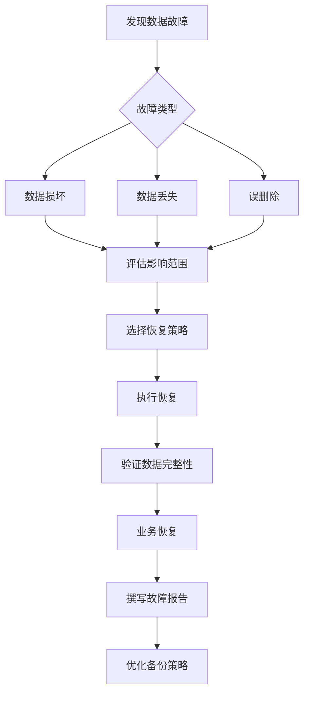

# 数据库备份与恢复策略（OPS-001）

## 概述

本文档定义学生求职AI助手项目的数据库备份与恢复策略，确保数据安全性和业务连续性。涵盖MySQL、Redis、Elasticsearch等数据存储组件的备份方案。

## 备份策略

### 备份目标
- **RPO（恢复点目标）**：≤ 1小时
- **RTO（恢复时间目标）**：≤ 4小时
- **数据保留期**：30天
- **备份完整性**：100%可恢复验证

### 备份层级
| 层级 | 数据类别 | 备份频率 | 保留期限 | 存储位置 |
|------|----------|----------|----------|----------|
| L1 | 核心业务数据 | 每日全量 + 每小时增量 | 30天 | 本地 + 云端 |
| L2 | 用户会话数据 | 每日全量 | 14天 | 本地 |
| L3 | 日志分析数据 | 每周全量 | 7天 | 本地 |
| L4 | 缓存数据 | 不备份（可重建） | - | - |

## MySQL备份方案

### 全量备份脚本
```bash
#!/bin/bash
# mysql_full_backup.sh
# 每日凌晨2点执行全量备份

# 配置
BACKUP_DIR="/backup/mysql/full"
DATE=$(date +%Y%m%d_%H%M%S)
RETENTION_DAYS=30
MYSQL_HOST="mysql"
MYSQL_PORT=3306
MYSQL_USER="backup_user"
MYSQL_PASSWORD="${MYSQL_BACKUP_PASSWORD}"
DATABASES="internship_db internship_logs"

# 创建备份目录
mkdir -p ${BACKUP_DIR}/${DATE}

# 备份每个数据库
for DB in ${DATABASES}; do
    echo "备份数据库: ${DB}"
    
    # 使用mysqldump备份
    mysqldump \
        --host=${MYSQL_HOST} \
        --port=${MYSQL_PORT} \
        --user=${MYSQL_USER} \
        --password=${MYSQL_PASSWORD} \
        --single-transaction \
        --routines \
        --triggers \
        --events \
        --max_allowed_packet=1G \
        ${DB} | gzip > ${BACKUP_DIR}/${DATE}/${DB}.sql.gz
    
    # 验证备份文件
    if [ $? -eq 0 ] && [ -s ${BACKUP_DIR}/${DATE}/${DB}.sql.gz ]; then
        echo "✅ 数据库 ${DB} 备份成功"
        
        # 记录备份信息
        echo "${DATE} ${DB} $(du -h ${BACKUP_DIR}/${DATE}/${DB}.sql.gz | cut -f1)" \
            >> ${BACKUP_DIR}/backup.log
    else
        echo "❌ 数据库 ${DB} 备份失败"
        exit 1
    fi
done

# 备份用户权限
mysqldump \
    --host=${MYSQL_HOST} \
    --port=${MYSQL_PORT} \
    --user=${MYSQL_USER} \
    --password=${MYSQL_PASSWORD} \
    --no-data \
    --all-databases \
    mysql > ${BACKUP_DIR}/${DATE}/mysql_users.sql

# 清理旧备份
find ${BACKUP_DIR} -type d -name "20*" -mtime +${RETENTION_DAYS} -exec rm -rf {} \;

echo "全量备份完成: ${DATE}"
```

### 增量备份脚本
```bash
#!/bin/bash
# mysql_incremental_backup.sh
# 每小时执行增量备份

# 配置
BACKUP_DIR="/backup/mysql/incremental"
DATE=$(date +%Y%m%d_%H)
BINLOG_DIR="/var/lib/mysql"
MYSQL_HOST="mysql"
MYSQL_USER="backup_user"
MYSQL_PASSWORD="${MYSQL_BACKUP_PASSWORD}"

# 创建备份目录
mkdir -p ${BACKUP_DIR}/${DATE}

# 刷新binlog并获取当前文件
mysql --host=${MYSQL_HOST} --user=${MYSQL_USER} --password=${MYSQL_PASSWORD} \
    -e "FLUSH BINARY LOGS; SHOW BINARY LOGS;" > ${BACKUP_DIR}/${DATE}/binlog_info.txt

# 获取最新的binlog文件
LATEST_BINLOG=$(tail -n 1 ${BACKUP_DIR}/${DATE}/binlog_info.txt | awk '{print $1}')

# 备份binlog文件
cp ${BINLOG_DIR}/${LATEST_BINLOG} ${BACKUP_DIR}/${DATE}/

# 压缩备份
gzip ${BACKUP_DIR}/${DATE}/${LATEST_BINLOG}

echo "增量备份完成: ${DATE} - ${LATEST_BINLOG}"
```

### 备份验证脚本
```bash
#!/bin/bash
# mysql_backup_verify.sh
# 每日验证备份完整性

# 配置
BACKUP_DIR="/backup/mysql/full"
DATE=$(date -d "yesterday" +%Y%m%d)
TEST_DB="backup_test_${DATE}"
MYSQL_HOST="mysql"
MYSQL_USER="backup_user"
MYSQL_PASSWORD="${MYSQL_BACKUP_PASSWORD}"

echo "验证备份: ${DATE}"

# 检查备份目录是否存在
if [ ! -d "${BACKUP_DIR}/${DATE}" ]; then
    echo "❌ 备份目录不存在: ${BACKUP_DIR}/${DATE}"
    exit 1
fi

# 创建测试数据库
mysql --host=${MYSQL_HOST} --user=${MYSQL_USER} --password=${MYSQL_PASSWORD} \
    -e "CREATE DATABASE IF NOT EXISTS ${TEST_DB};"

# 恢复每个数据库
for BACKUP_FILE in ${BACKUP_DIR}/${DATE}/*.sql.gz; do
    DB_NAME=$(basename ${BACKUP_FILE} .sql.gz)
    
    echo "验证数据库: ${DB_NAME}"
    
    # 解压并导入
    gunzip -c ${BACKUP_FILE} | \
        mysql --host=${MYSQL_HOST} --user=${MYSQL_USER} --password=${MYSQL_PASSWORD} ${TEST_DB}
    
    if [ $? -eq 0 ]; then
        # 验证表数量
        TABLE_COUNT=$(mysql --host=${MYSQL_HOST} --user=${MYSQL_USER} --password=${MYSQL_PASSWORD} \
            -e "SELECT COUNT(*) FROM information_schema.tables WHERE table_schema='${TEST_DB}';" -s)
        
        echo "✅ ${DB_NAME} 恢复成功，表数量: ${TABLE_COUNT}"
    else
        echo "❌ ${DB_NAME} 恢复失败"
        exit 1
    fi
done

# 清理测试数据库
mysql --host=${MYSQL_HOST} --user=${MYSQL_USER} --password=${MYSQL_PASSWORD} \
    -e "DROP DATABASE ${TEST_DB};"

echo "备份验证完成"
```

## Redis备份方案

### RDB快照备份
```bash
#!/bin/bash
# redis_backup.sh
# 每6小时执行RDB备份

# 配置
BACKUP_DIR="/backup/redis"
DATE=$(date +%Y%m%d_%H%M%S)
RETENTION_DAYS=7
REDIS_HOST="redis"
REDIS_PORT=6379
REDIS_PASSWORD="${REDIS_PASSWORD}"

# 创建备份目录
mkdir -p ${BACKUP_DIR}/${DATE}

# 触发BGSAVE
redis-cli -h ${REDIS_HOST} -p ${REDIS_PORT} -a ${REDIS_PASSWORD} BGSAVE

# 等待备份完成
sleep 30

# 获取最新RDB文件
LATEST_RDB=$(redis-cli -h ${REDIS_HOST} -p ${REDIS_PORT} -a ${REDIS_PASSWORD} \
    CONFIG GET dir | tail -n 1)/dump.rdb

# 复制备份文件
cp ${LATEST_RDB} ${BACKUP_DIR}/${DATE}/dump_${DATE}.rdb

# 压缩备份
gzip ${BACKUP_DIR}/${DATE}/dump_${DATE}.rdb

# 清理旧备份
find ${BACKUP_DIR} -type d -name "20*" -mtime +${RETENTION_DAYS} -exec rm -rf {} \;

echo "Redis备份完成: ${DATE}"
```

### AOF持久化配置
```redis
# redis.conf 生产配置
appendonly yes
appendfilename "appendonly.aof"
appendfsync everysec
auto-aof-rewrite-percentage 100
auto-aof-rewrite-min-size 64mb
aof-load-truncated yes
```

## Elasticsearch备份方案

### 快照仓库配置
```bash
#!/bin/bash
# es_snapshot_setup.sh
# 配置快照仓库

# 创建快照仓库
curl -X PUT "http://elasticsearch:9200/_snapshot/backup_repository" \
    -H 'Content-Type: application/json' \
    -d '{
        "type": "fs",
        "settings": {
            "location": "/backup/elasticsearch/snapshots",
            "compress": true,
            "max_restore_bytes_per_sec": "100mb",
            "max_snapshot_bytes_per_sec": "50mb"
        }
    }'
```

### 自动化快照脚本
```bash
#!/bin/bash
# es_snapshot_backup.sh
# 每日执行快照备份

# 配置
SNAPSHOT_NAME="snapshot_$(date +%Y%m%d_%H%M%S)"
RETENTION_DAYS=30

# 创建快照
curl -X PUT "http://elasticsearch:9200/_snapshot/backup_repository/${SNAPSHOT_NAME}?wait_for_completion=true" \
    -H 'Content-Type: application/json' \
    -d '{
        "indices": "internship-*",
        "ignore_unavailable": true,
        "include_global_state": false,
        "metadata": {
            "taken_by": "backup_system",
            "taken_because": "daily_backup"
        }
    }'

# 验证快照
curl -X GET "http://elasticsearch:9200/_snapshot/backup_repository/${SNAPSHOT_NAME}/_status"

# 清理旧快照
curl -X DELETE "http://elasticsearch:9200/_snapshot/backup_repository/snapshot_$(date -d "${RETENTION_DAYS} days ago" +%Y%m%d)*"

echo "Elasticsearch快照完成: ${SNAPSHOT_NAME}"
```

## 恢复流程

### 紧急恢复流程


### MySQL恢复脚本
```bash
#!/bin/bash
# mysql_restore.sh
# 数据库恢复脚本

# 配置
BACKUP_DATE=${1:-$(date -d "yesterday" +%Y%m%d)}
BACKUP_DIR="/backup/mysql/full/${BACKUP_DATE}"
MYSQL_HOST="mysql"
MYSQL_USER="root"
MYSQL_PASSWORD="${MYSQL_ROOT_PASSWORD}"

echo "开始恢复数据库: ${BACKUP_DATE}"

# 检查备份目录
if [ ! -d "${BACKUP_DIR}" ]; then
    echo "❌ 备份目录不存在: ${BACKUP_DIR}"
    exit 1
fi

# 停止应用服务
systemctl stop internship-backend

# 恢复每个数据库
for BACKUP_FILE in ${BACKUP_DIR}/*.sql.gz; do
    DB_NAME=$(basename ${BACKUP_FILE} .sql.gz)
    
    echo "恢复数据库: ${DB_NAME}"
    
    # 删除现有数据库
    mysql --host=${MYSQL_HOST} --user=${MYSQL_USER} --password=${MYSQL_PASSWORD} \
        -e "DROP DATABASE IF EXISTS ${DB_NAME}; CREATE DATABASE ${DB_NAME};"
    
    # 恢复数据
    gunzip -c ${BACKUP_FILE} | \
        mysql --host=${MYSQL_HOST} --user=${MYSQL_USER} --password=${MYSQL_PASSWORD} ${DB_NAME}
    
    if [ $? -eq 0 ]; then
        echo "✅ ${DB_NAME} 恢复成功"
    else
        echo "❌ ${DB_NAME} 恢复失败"
        exit 1
    fi
done

# 恢复用户权限
if [ -f "${BACKUP_DIR}/mysql_users.sql" ]; then
    mysql --host=${MYSQL_HOST} --user=${MYSQL_USER} --password=${MYSQL_PASSWORD} \
        mysql < ${BACKUP_DIR}/mysql_users.sql
fi

# 启动应用服务
systemctl start internship-backend

echo "数据库恢复完成"
```

### Redis恢复脚本
```bash
#!/bin/bash
# redis_restore.sh
# Redis恢复脚本

# 配置
BACKUP_DATE=${1:-$(date -d "yesterday" +%Y%m%d)}
BACKUP_FILE="/backup/redis/${BACKUP_DATE}/dump_${BACKUP_DATE}.rdb.gz"
REDIS_HOST="redis"
REDIS_PORT=6379
REDIS_PASSWORD="${REDIS_PASSWORD}"

echo "开始恢复Redis: ${BACKUP_DATE}"

# 检查备份文件
if [ ! -f "${BACKUP_FILE}" ]; then
    echo "❌ 备份文件不存在: ${BACKUP_FILE}"
    exit 1
fi

# 停止Redis
systemctl stop redis

# 解压备份文件
gunzip -c ${BACKUP_FILE} > /var/lib/redis/dump.rdb

# 修改权限
chown redis:redis /var/lib/redis/dump.rdb

# 启动Redis
systemctl start redis

# 验证恢复
sleep 5
redis-cli -h ${REDIS_HOST} -p ${REDIS_PORT} -a ${REDIS_PASSWORD} INFO | grep "db0:"

echo "Redis恢复完成"
```

## 备份监控与告警

### 监控指标
| 指标 | 采集方式 | 告警阈值 | 通知方式 |
|------|----------|----------|----------|
| 备份成功率 | 备份脚本退出码 | 成功率 < 99% | 电话+短信 |
| 备份文件大小 | 文件系统监控 | 大小异常 ±50% | IM+邮件 |
| 备份耗时 | 脚本执行时间 | > 2小时 | IM通知 |
| 存储空间 | 磁盘监控 | 使用率 > 85% | IM通知 |

### 告警规则
```yaml
# Prometheus告警规则
groups:
  - name: backup_monitoring
    rules:
      - alert: BackupFailed
        expr: increase(backup_failed_total[24h]) > 0
        for: 5m
        labels:
          severity: critical
        annotations:
          summary: "备份失败"
          description: "过去24小时内检测到备份失败"
          
      - alert: BackupStorageFull
        expr: disk_used_percent{device="/backup"} > 85
        for: 10m
        labels:
          severity: warning
        annotations:
          summary: "备份存储空间不足"
          description: "备份磁盘使用率 {{ $value }}% > 85%"
```

## 备份策略验证计划

### 定期恢复测试
| 测试类型 | 频率 | 测试内容 | 验收标准 |
|----------|------|----------|----------|
| 全量恢复测试 | 每月 | 恢复最近的全量备份 | RTO ≤ 4小时，数据完整性100% |
| 增量恢复测试 | 每季度 | 恢复增量备份链 | 数据连续性验证 |
| 应急恢复演练 | 每半年 | 模拟生产环境灾难恢复 | 团队响应时间 ≤ 30分钟 |

### 恢复测试报告模板
```markdown
# 恢复测试报告

## 测试信息
- 测试日期: YYYY-MM-DD
- 测试类型: [全量/增量/应急]
- 测试负责人: [姓名]

## 测试结果
| 指标 | 目标值 | 实际值 | 是否达标 |
|------|--------|--------|----------|
| RTO | ≤ 4小时 | X小时 | ✓/✗ |
| RPO | ≤ 1小时 | X小时 | ✓/✗ |
| 数据完整性 | 100% | X% | ✓/✗ |
| 业务影响 | 无 | [描述] | ✓/✗ |

## 问题与改进
1. [发现问题1]
   - 影响: 
   - 解决方案: 
   - 负责人: 

2. [发现问题2]
   - 影响: 
   - 解决方案: 
   - 负责人: 

## 结论
[测试通过/失败，后续行动计划]
```

## 自动化调度

### Crontab配置
```bash
# /etc/crontab
# MySQL备份调度
0 2 * * * root /scripts/mysql_full_backup.sh >> /var/log/backup/mysql_full.log 2>&1
0 */6 * * * root /scripts/mysql_incremental_backup.sh >> /var/log/backup/mysql_incr.log 2>&1
0 3 * * * root /scripts/mysql_backup_verify.sh >> /var/log/backup/mysql_verify.log 2>&1

# Redis备份调度
0 */6 * * * root /scripts/redis_backup.sh >> /var/log/backup/redis.log 2>&1

# Elasticsearch备份调度
0 1 * * * root /scripts/es_snapshot_backup.sh >> /var/log/backup/es.log 2>&1

# 备份监控
*/5 * * * * root /scripts/backup_monitor.sh >> /var/log/backup/monitor.log 2>&1
```

## 附录

### 备份存储规划
| 存储位置 | 容量 | 用途 | 访问权限 |
|----------|------|------|----------|
| 本地磁盘 | 1TB | 近期备份（7天） | 备份服务器 |
| 对象存储 | 5TB | 长期归档（30天） | 只读访问 |
| 异地灾备 | 1TB | 灾难恢复 | 紧急访问 |

### 联系人列表
| 角色 | 姓名 | 联系方式 | 职责 |
|------|------|----------|------|
| 备份负责人 | [姓名] | 电话/IM | 备份策略执行 |
| 恢复负责人 | [姓名] | 电话/IM | 数据恢复操作 |
| 应急协调人 | [姓名] | 电话/IM | 紧急情况协调 |

### 变更记录
| 日期 | 版本 | 变更内容 | 变更人 |
|------|------|----------|--------|
| 2026-04-11 | 1.0 | 初始版本创建 | Claude |
| [日期] | [版本] | [变更描述] | [姓名] |

---

**关联文档**：
- [Phase5_Task_Checklist.md](./Phase5_Task_Checklist.md) - 阶段5任务清单
- [Emergency_Response_Plan.md](./Emergency_Response_Plan.md) - 应急预案
- [Monitoring_Configuration.md](./Monitoring_Configuration.md) - 监控配置