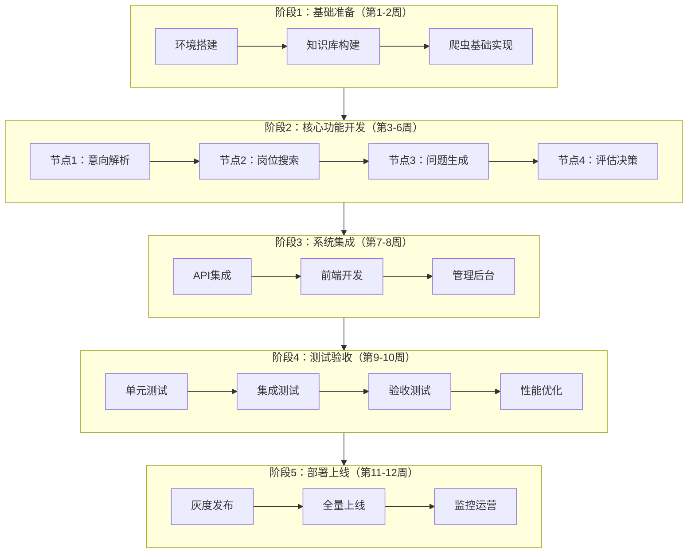

# 学生求职AI助手 - 开发流程文档

**版本**：v1.0 MVP  
**日期**：2026-04-11  
**状态**：初稿

---

## 文档说明

本文档基于以下五个核心文档制定：
- [System_Prompt.md](../prompts/System_Prompt.md) - AI员工系统提示词
- [Workflow.md](./Workflow.md) - 原子任务工作流
- [Knowledge_and_Data.md](./Knowledge_and_Data.md) - 知识库与数据需求
- [Functional_Spec.md](./Functional_Spec.md) - 功能与后台需求
- [Metrics_Framework.md](./Metrics_Framework.md) - 验收与评估指标

---

## 开发流程概览



---

## 阶段1：基础准备（第1-2周）

### 1.1 环境搭建

#### 1.1.1 开发环境配置
| 组件 | 技术要求 | 备注 |
|------|----------|------|
| Python | 3.9+ | 主开发语言 |
| Node.js | 18+ | 前端开发 |
| MySQL | 8.0+ | 业务数据存储 |
| Redis | 6.0+ | 会话缓存 |
| Docker | 最新版 | 容器化部署 |
| Git | 最新版 | 版本控制 |

#### 1.1.2 项目结构初始化
```
jobseeker-ai/
├── backend/                 # 后端服务
│   ├── app/
│   │   ├── api/            # API接口
│   │   ├── core/           # 核心引擎
│   │   ├── models/         # 数据模型
│   │   └── utils/          # 工具函数
│   ├── crawlers/           # 爬虫模块
│   ├── config/             # 配置文件
│   └── requirements.txt
├── frontend/               # 前端应用
│   ├── src/
│   │   ├── components/     # 组件
│   │   ├── pages/          # 页面
│   │   └── services/       # API服务
│   └── package.json
├── admin/                  # 管理后台
├── knowledge/              # 知识库数据
├── scripts/                # 脚本工具
├── tests/                  # 测试用例
└── docker-compose.yml
```

#### 1.1.3 依赖安装清单
```bash
# 后端核心依赖
pip install fastapi uvicorn sqlalchemy pymysql redis
pip install scrapy playwright beautifulsoup4 lxml
pip install jieba scikit-learn sentence-transformers
pip install openai httpx python-dotenv

# 前端核心依赖
npm install vue@3 axios element-plus vue-router pinia
npm install echarts markdown-it
```

### 1.2 知识库构建

#### 1.2.1 岗位模板库搭建
**参考文档**：Knowledge_and_Data.md 第2.1节

| 任务 | 负责人 | 交付物 | 验收标准 |
|------|--------|--------|----------|
| 定义岗位数据结构 | 后端 | JSON Schema | 包含10个必填字段 |
| 收集20个MVP岗位 | 运营 | 岗位JSON文件 | 覆盖主流实习类型 |
| 录入岗位别名 | 运营 | 同义词映射表 | 每个岗位≥2个别名 |
| 定义核心技能 | 运营 | 技能关联表 | 每个岗位5-10个技能 |

**岗位模板示例**：
```json
{
  "job_type": "产品经理",
  "aliases": ["产品助理", "产品专员", "产品实习生"],
  "category": "互联网产品",
  "required_skills": ["Axure", "XMind", "数据分析"],
  "optional_skills": ["SQL", "Python", "Figma"],
  "key_competencies": ["需求分析", "原型设计", "项目管理"],
  "interview_focus": ["项目经历", "产品思维", "数据分析能力"]
}
```

#### 1.2.2 技能映射库搭建
**参考文档**：Knowledge_and_Data.md 第2.2节

| 任务 | 数量目标 | 完成标准 |
|------|----------|----------|
| 技能词条收集 | 500+ | 覆盖主流技术栈 |
| 技能分类整理 | 10+类别 | 分类清晰无重叠 |
| 同义词映射 | 每个技能2-5个 | 提高召回率 |
| 关联技能标注 | 每个技能3-5个 | 支持智能推荐 |

#### 1.2.3 城市代码库搭建
**参考文档**：Knowledge_and_Data.md 第2.6节

```python
# 城市代码配置示例
CITY_CODES = {
    "上海": {
        "zhipin": "101020100",
        "liepin": "020",
        "zhilian": "538",
        "wuyou": "020000"
    },
    # ... 其他城市
}
```

### 1.3 爬虫基础实现

#### 1.3.1 爬虫架构设计
**参考文档**：Workflow.md 第2.4节、Functional_Spec.md 第2.2节

```python
# 爬虫基类设计
class BaseCrawler(ABC):
    """爬虫基类，定义通用接口"""
    
    @abstractmethod
    def search(self, keywords: dict) -> List[Job]:
        """执行搜索"""
        pass
    
    @abstractmethod
    def parse_detail(self, url: str) -> JobDetail:
        """解析详情页"""
        pass
    
    def anti_detect(self):
        """反爬策略：User-Agent轮换、代理IP、随机延时"""
        pass
```

#### 1.3.2 反爬策略配置
**参考文档**：Workflow.md 第2.4.3节

| 策略 | 实现方式 | 配置参数 |
|------|----------|----------|
| User-Agent轮换 | 使用fake-useragent库 | 每次请求随机切换 |
| 代理IP池 | 集成第三方代理服务 | 失败自动切换 |
| 请求间隔 | 随机延时 | 1-5秒随机 |
| Cookie管理 | 会话保持 | 定期更新 |

#### 1.3.3 数据清洗规则
**参考文档**：Workflow.md 第2.4.3节

```python
CLEANING_RULES = {
    "salary": {
        "面议": None,
        "pattern": r'(\d+)-(\d+)(K|元/天)',
        "transform": "parse_range"
    },
    "location": {
        "上海-浦东": "上海",
        "pattern": r'^(\w+)-',
        "transform": "extract_city"
    },
    "education": {
        "本科及以上": "本科",
        "pattern": r'(\w+)及以上',
        "transform": "extract_base"
    }
}
```

---

## 阶段2：核心功能开发（第3-6周）

### 2.1 节点1：意向解析与关键词生成

#### 2.1.1 开发任务分解
**参考文档**：Workflow.md 第1.4节、Functional_Spec.md 第2.1节

| 子任务 | 工期 | 依赖 | 验收标准 |
|--------|------|------|----------|
| 文本清洗模块 | 2天 | 无 | 去除语气词准确率≥98% |
| 实体识别模块 | 3天 | 技能库 | 识别准确率≥90% |
| 关键词扩展模块 | 2天 | 技能库 | 召回率≥85% |
| 缺失值填充模块 | 1天 | 无 | 默认值合理 |
| API接口封装 | 2天 | 上述模块 | 响应时间≤500ms |

#### 2.1.2 核心算法实现
```python
class IntentParser:
    """意图解析器"""
    
    def __init__(self):
        self.job_types = load_job_types()  # 岗位类型库
        self.skill_dict = load_skills()     # 技能词典
        self.city_dict = load_cities()      # 城市词典
    
    def parse(self, raw_input: str) -> Dict:
        """解析用户输入"""
        # 1. 文本清洗
        cleaned = self.clean_text(raw_input)
        
        # 2. 分词
        words = jieba.lcut(cleaned)
        
        # 3. 实体识别
        entities = {
            "job_type": self.extract_job_type(words),
            "skills": self.extract_skills(words),
            "cities": self.extract_cities(words),
            "education": self.extract_education(words),
            "experience": self.extract_experience(words)
        }
        
        # 4. 关键词扩展
        expanded = self.expand_keywords(entities)
        
        # 5. 缺失值填充
        filled = self.fill_defaults(expanded)
        
        return filled
```

#### 2.1.3 接口契约
```
POST /api/v1/parse-intent
Request:  { "raw_input": "..." }
Response: { "keywords": {...}, "confidence": 0.92 }
```

### 2.2 节点2：岗位搜索与匹配

#### 2.2.1 开发任务分解
**参考文档**：Workflow.md 第2.4节、Functional_Spec.md 第2.2节

| 子任务 | 工期 | 依赖 | 验收标准 |
|--------|------|------|----------|
| BOSS直聘爬虫 | 3天 | 基础爬虫 | 成功率≥85% |
| 智联招聘爬虫 | 2天 | 基础爬虫 | 成功率≥85% |
| 前程无忧爬虫 | 2天 | 基础爬虫 | 成功率≥85% |
| 猎聘爬虫 | 3天 | 基础爬虫 | 成功率≥70% |
| 数据清洗模块 | 2天 | 各爬虫 | 字段完整率≥98% |
| 匹配度算法 | 3天 | 向量化 | TOP10平均≥70% |
| 去重模块 | 1天 | 无 | 重复率≤15% |
| 搜索调度器 | 2天 | 上述模块 | 并行执行 |

#### 2.2.2 爬虫实现要点

**BOSS直聘爬虫**
```python
class ZhipinCrawler(BaseCrawler):
    """BOSS直聘爬虫"""
    
    BASE_URL = "https://www.zhipin.com/web/geek/job"
    
    async def search(self, keywords: dict) -> List[Job]:
        # 构造查询参数
        params = {
            "query": " ".join(keywords["job_type"]),
            "city": CITY_CODES[keywords["cities"][0]]["zhipin"]
        }
        
        # 使用Playwright渲染页面
        async with async_playwright() as p:
            browser = await p.chromium.launch()
            page = await browser.new_page()
            
            # 设置反爬头
            await page.set_extra_http_headers({
                "User-Agent": get_random_ua()
            })
            
            # 访问页面并等待加载
            await page.goto(f"{self.BASE_URL}?{urlencode(params)}")
            await page.wait_for_selector(".job-list-box")
            
            # 提取数据
            jobs = await page.evaluate(self.EXTRACT_SCRIPT)
            
        return jobs
```

**智联招聘爬虫（JSON接口）**
```python
class ZhilianCrawler(BaseCrawler):
    """智联招聘爬虫"""
    
    async def search(self, keywords: dict) -> List[Job]:
        # 直接调用JSON接口
        api_url = "https://fe-api.zhaopin.com/c/i/sou"
        params = {
            "start": 0,
            "pageSize": 90,
            "cityId": CITY_CODES[keywords["cities"][0]]["zhilian"],
            "kw": " ".join(keywords["job_type"]),
            "kt": 3
        }
        
        headers = {
            "User-Agent": get_random_ua(),
            "Referer": "https://sou.zhaopin.com/"
        }
        
        async with aiohttp.ClientSession() as session:
            async with session.get(api_url, params=params, headers=headers) as resp:
                data = await resp.json()
                return self.parse_jobs(data["data"]["results"])
```

#### 2.2.3 匹配度算法实现
**参考文档**：Workflow.md 第2.4.4节

```python
class MatchCalculator:
    """匹配度计算器"""
    
    def __init__(self):
        # 加载TF-IDF向量化器或BERT模型
        self.vectorizer = TfidfVectorizer(tokenizer=jieba.lcut)
        # 或
        # self.encoder = SentenceTransformer('paraphrase-multilingual-MiniLM-L12-v2')
    
    def calculate(self, resume_text: str, jd_text: str) -> Dict:
        """计算匹配度"""
        # 1. 文本向量化
        vectors = self.vectorizer.fit_transform([resume_text, jd_text])
        
        # 2. 计算余弦相似度
        base_score = cosine_similarity(vectors[0:1], vectors[1:2])[0][0] * 100
        
        # 3. 关键词匹配加分
        resume_keywords = set(jieba.lcut(resume_text))
        jd_keywords = set(jieba.lcut(jd_text))
        matched = resume_keywords & jd_keywords
        keyword_bonus = len(matched) / len(jd_keywords) * 20
        
        # 4. 加权计算
        final_score = min(base_score * 0.6 + keyword_bonus, 100)
        
        return {
            "match_score": round(final_score, 1),
            "match_details": {
                "base_similarity": round(base_score, 1),
                "keyword_bonus": round(keyword_bonus, 1),
                "matched_keywords": list(matched)
            }
        }
```

### 2.3 节点3：个性化问题生成

#### 2.3.1 开发任务分解
**参考文档**：Workflow.md 第3.4节、Functional_Spec.md 第2.3节

| 子任务 | 工期 | 依赖 | 验收标准 |
|--------|------|------|----------|
| JD解析模块 | 2天 | NLP基础 | 关键能力提取准确率≥85% |
| Prompt模板设计 | 2天 | 无 | 覆盖两种版本 |
| LLM调用封装 | 2天 | API密钥 | 响应时间≤3s |
| 问题质量过滤 | 2天 | 规则库 | 重复率≤10% |
| 缓存机制 | 1天 | Redis | 相同JD命中缓存 |

#### 2.3.2 Prompt工程
**参考文档**：Functional_Spec.md 第2.3.2节

```python
QUESTION_GENERATION_PROMPT = """
你是一位资深互联网大厂面试官，请根据以下信息为候选人设计面试问题。

【岗位信息】
岗位名称：{job_title}
公司：{company}
JD内容：
{jd_text}

【候选人背景】
技能：{skills}
项目经历：{projects}

【设计要求】
1. 设计3-5个**一般实习版**问题：
   - 侧重基础技能验证
   - 侧重执行力（能否完成任务）
   - 侧重学习能力（如何快速上手）
   - 问题具体、可操作

2. 设计3-5个**高阶实习/校招版**问题：
   - 侧重项目深度（系统性思考）
   - 侧重问题解决（复杂场景分析）
   - 侧重业务理解（商业洞察）
   - 侧重团队协作（沟通与推动）

3. 每个问题需标注：
   - 考察的能力点
   - 对应的JD原文依据
   - 建议回答时间

4. 问题需与JD要求紧密相关，避免通用模板

【输出格式】
```json
{{
  "general": [
    {{
      "question": "问题内容",
      "competency": "考察能力",
      "jd_reference": "JD原文",
      "suggested_time": "3-5分钟"
    }}
  ],
  "advanced": [
    {{
      "question": "问题内容",
      "competency": "考察能力",
      "jd_reference": "JD原文",
      "suggested_time": "5-8分钟"
    }}
  ]
}}
```
"""
```

#### 2.3.3 LLM服务封装
```python
class LLMService:
    """大语言模型服务"""
    
    def __init__(self):
        self.client = OpenAI(api_key=os.getenv("OPENAI_API_KEY"))
        self.model = "gpt-4"  # 或 "gpt-3.5-turbo"
        self.temperature = 0.7
    
    async def generate_questions(self, job: Job, resume: Resume) -> Dict:
        """生成面试问题"""
        prompt = QUESTION_GENERATION_PROMPT.format(
            job_title=job.title,
            company=job.company,
            jd_text=job.jd_text,
            skills=", ".join(resume.skills),
            projects=resume.project_summary
        )
        
        response = await self.client.chat.completions.create(
            model=self.model,
            messages=[
                {"role": "system", "content": "你是一位资深面试官"},
                {"role": "user", "content": prompt}
            ],
            temperature=self.temperature,
            max_tokens=2000,
            response_format={"type": "json_object"}
        )
        
        return json.loads(response.choices[0].message.content)
```

### 2.4 节点4：模拟回答评估

#### 2.4.1 开发任务分解
**参考文档**：Workflow.md 第4.4节、Functional_Spec.md 第2.4节

| 子任务 | 工期 | 依赖 | 验收标准 |
|--------|------|------|----------|
| 关键词匹配模块 | 2天 | 技能库 | 匹配准确率≥90% |
| 语义分析模块 | 2天 | LLM/BERT | 语义相关性检测 |
| 多维度评分模块 | 3天 | 评分规则 | 4维度评分实现 |
| 改进建议生成 | 2天 | 模板库 | 建议可执行率≥85% |
| 决策逻辑实现 | 1天 | 评分模块 | 决策准确率≥80% |

#### 2.4.2 评估算法实现
```python
class AnswerEvaluator:
    """回答评估器"""
    
    def __init__(self):
        self.skill_keywords = load_skill_keywords()
        self.llm_service = LLMService()
    
    def evaluate(self, answer: str, question: Question, jd: Job) -> Dict:
        """评估学生回答"""
        
        # 1. 内容质量检查
        if len(answer) < 20:
            return {"error": "回答内容不足，请详细描述"}
        
        # 2. 关键词匹配分析
        keyword_matches = self.match_keywords(answer, jd.requirements)
        
        # 3. 多维度评分
        scores = {
            "skill_coverage": self.score_skill_coverage(answer, jd.requirements),
            "specificity": self.score_specificity(answer),
            "logic": self.score_logic(answer),
            "quantification": self.score_quantification(answer)
        }
        
        # 4. 计算综合分
        weights = {"skill_coverage": 0.3, "specificity": 0.25, "logic": 0.25, "quantification": 0.2}
        overall = sum(scores[k] * weights[k] for k in scores)
        
        # 5. 生成改进建议
        improvements = self.generate_improvements(answer, scores, jd)
        
        # 6. 决策判定
        decision = self.make_decision(overall)
        
        return {
            "scores": {k: round(v, 1) for k, v in scores.items()},
            "overall": round(overall, 1),
            "keyword_matches": keyword_matches,
            "improvements": improvements,
            "decision": decision
        }
    
    def score_skill_coverage(self, answer: str, requirements: List[str]) -> float:
        """评分：岗位技能覆盖度"""
        matched = sum(1 for req in requirements if req in answer)
        return min(matched / len(requirements) * 10, 10)
    
    def score_specificity(self, answer: str) -> float:
        """评分：案例具体性"""
        markers = ["项目", "负责", "完成", "实现", "设计", "开发"]
        count = sum(1 for m in markers if m in answer)
        return min(count / len(markers) * 10 + 5, 10)
    
    def score_logic(self, answer: str) -> float:
        """评分：逻辑表达"""
        # 检测STAR结构
        has_situation = any(w in answer for w in ["当时", "背景", "项目"])
        has_task = any(w in answer for w in ["负责", "需要", "任务"])
        has_action = any(w in answer for w in ["首先", "然后", "通过"])
        has_result = any(w in answer for w in ["结果", "最终", "完成"])
        
        score = sum([has_situation, has_task, has_action, has_result]) * 2.5
        return min(score, 10)
    
    def score_quantification(self, answer: str) -> float:
        """评分：量化成果"""
        import re
        has_numbers = bool(re.search(r'\d+%?|\d+个|\d+万|\d+倍', answer))
        return 8 if has_numbers else 4
    
    def make_decision(self, overall: float) -> str:
        """决策判定"""
        if overall >= 7:
            return "通过"
        elif overall >= 5:
            return "待提升"
        else:
            return "不通过"
```

---

## 阶段3：系统集成（第7-8周）

### 3.1 API服务集成

#### 3.1.1 服务架构
```python
# FastAPI主应用
from fastapi import FastAPI
from app.api import parse, search, questions, evaluate

app = FastAPI(title="学生求职AI助手")

# 注册路由
app.include_router(parse.router, prefix="/api/v1")
app.include_router(search.router, prefix="/api/v1")
app.include_router(questions.router, prefix="/api/v1")
app.include_router(evaluate.router, prefix="/api/v1")
```

#### 3.1.2 中间件配置
```python
# CORS配置
app.add_middleware(
    CORSMiddleware,
    allow_origins=["*"],  # 生产环境需限制域名
    allow_credentials=True,
    allow_methods=["*"],
    allow_headers=["*"],
)

# 错误处理
@app.exception_handler(Exception)
async def global_exception_handler(request, exc):
    logger.error(f"Error: {exc}", exc_info=True)
    return JSONResponse(
        status_code=500,
        content={"code": 500, "message": "系统错误，请稍后重试"}
    )
```

### 3.2 前端开发

#### 3.2.1 页面开发顺序
| 页面 | 工期 | 依赖API | 验收标准 |
|------|------|---------|----------|
| 首页/意向输入 | 3天 | /parse-intent | 交互流畅 |
| 岗位列表页 | 4天 | /search-jobs | 支持筛选排序 |
| 问题练习页 | 3天 | /generate-questions | 两套问题展示 |
| 评估报告页 | 3天 | /evaluate-answer | 评分可视化 |
| 用户中心 | 2天 | 用户相关 | 历史记录 |

#### 3.2.2 技术栈
- **框架**：Vue 3 + TypeScript
- **UI组件库**：Element Plus
- **状态管理**：Pinia
- **路由**：Vue Router
- **HTTP客户端**：Axios
- **图表**：ECharts

### 3.3 管理后台开发

#### 3.3.1 功能模块
**参考文档**：Functional_Spec.md 第4.1节

| 模块 | 功能点 | 工期 |
|------|--------|------|
| 数据看板 | 搜索量、评估量、热门岗位 | 2天 |
| 爬虫监控 | 各平台状态、成功率 | 2天 |
| 知识库管理 | 岗位/技能/问题库CRUD | 3天 |
| 评估抽检 | 随机抽样、人工复核 | 2天 |
| 配置管理 | 参数调整、阈值配置 | 2天 |

---

## 阶段4：测试验收（第9-10周）

### 4.1 单元测试

#### 4.1.1 测试范围
```
tests/
├── unit/
│   ├── test_intent_parser.py      # 意图解析测试
│   ├── test_crawlers.py           # 爬虫测试
│   ├── test_match_calculator.py   # 匹配度计算测试
│   ├── test_question_generator.py # 问题生成测试
│   └── test_evaluator.py          # 评估器测试
```

#### 4.1.2 测试用例示例
```python
# test_intent_parser.py
class TestIntentParser:
    
    def test_parse_product_manager(self):
        """测试产品经理岗位解析"""
        parser = IntentParser()
        result = parser.parse("我想找产品经理实习，地点上海")
        
        assert "产品经理" in result["job_type"]
        assert "上海" in result["cities"]
        assert result["experience"] == "实习"
    
    def test_clean_text(self):
        """测试文本清洗"""
        parser = IntentParser()
        cleaned = parser.clean_text("我想找一份产品经理实习")
        
        assert "我想" not in cleaned
        assert "一份" not in cleaned
```

### 4.2 集成测试

#### 4.2.1 测试场景
| 场景 | 测试内容 | 通过标准 |
|------|----------|----------|
| 完整流程 | 意向输入→岗位搜索→问题生成→评估 | 全流程无错误 |
| 异常处理 | 爬虫失败、LLM超时、解析错误 | 优雅降级 |
| 并发测试 | 10用户同时搜索 | 响应时间≤15s |
| 数据一致性 | 多次相同搜索 | 结果一致性≥90% |

### 4.3 验收测试

#### 4.3.1 P0级验收标准
**参考文档**：Metrics_Framework.md 第6.1节

| 验收项 | 测试方法 | 通过标准 |
|--------|----------|----------|
| 关键词生成 | 人工抽检10个案例 | 9/10通过 |
| 岗位数量 | 自动化测试 | 100%返回≥10个 |
| 平台覆盖 | 自动化测试 | 100%来自≥2平台 |
| 匹配度质量 | 系统计算 | TOP10平均≥70% |
| 问题覆盖 | 人工抽检10个岗位 | 9/10覆盖≥90% |
| 评估一致性 | 人工对比20个案例 | 16/20一致 |

### 4.4 性能优化

#### 4.4.1 优化清单
| 优化项 | 优化前 | 优化后 | 方法 |
|--------|--------|--------|------|
| 搜索响应时间 | 15s | ≤10s | 缓存+并行 |
| 爬虫成功率 | 70% | ≥85% | 代理池+重试 |
| 匹配度计算 | 2s | ≤500ms | 向量缓存 |
| 问题生成 | 5s | ≤3s | Prompt优化 |

---

## 阶段5：部署上线（第11-12周）

### 5.1 部署架构

#### 5.1.1 容器化配置
```yaml
# docker-compose.yml
version: '3.8'
services:
  app:
    build: ./backend
    ports:
      - "8000:8000"
    environment:
      - DATABASE_URL=mysql+pymysql://user:pass@db/jobseeker
      - REDIS_URL=redis://redis:6379
    depends_on:
      - db
      - redis
  
  db:
    image: mysql:8.0
    environment:
      - MYSQL_ROOT_PASSWORD=xxx
      - MYSQL_DATABASE=jobseeker
    volumes:
      - mysql_data:/var/lib/mysql
  
  redis:
    image: redis:6-alpine
    volumes:
      - redis_data:/data
  
  nginx:
    image: nginx:alpine
    ports:
      - "80:80"
      - "443:443"
    volumes:
      - ./nginx.conf:/etc/nginx/nginx.conf
```

### 5.2 灰度发布

#### 5.2.1 发布计划
| 阶段 | 用户比例 | 时长 | 观察指标 |
|------|----------|------|----------|
| 内部测试 | 内部用户 | 3天 | 功能完整性 |
| 小流量 | 5% | 3天 | 错误率、响应时间 |
| 中流量 | 20% | 3天 | 用户满意度 |
| 全量发布 | 100% | - | 核心业务指标 |

### 5.3 监控运营

#### 5.3.1 监控指标
**参考文档**：Metrics_Framework.md 第7.2节

| 指标 | 告警级别 | 阈值 | 通知方式 |
|------|----------|------|----------|
| 系统可用性 | P0 | <99% | 电话+短信+IM |
| 搜索成功率 | P0 | <80% | IM+邮件 |
| 爬虫成功率 | P1 | <70% | IM |
| 响应时间P95 | P1 | >15s | IM |

#### 5.3.2 日志收集
```python
# 日志配置
LOGGING_CONFIG = {
    "version": 1,
    "handlers": {
        "file": {
            "class": "logging.handlers.RotatingFileHandler",
            "filename": "logs/app.log",
            "maxBytes": 10485760,  # 10MB
            "backupCount": 10
        },
        "elasticsearch": {
            "class": "CMRESHandler",
            "hosts": [{"host": "es-host", "port": 9200}]
        }
    },
    "loggers": {
        "app": {
            "handlers": ["file", "elasticsearch"],
            "level": "INFO"
        }
    }
}
```

---

## 里程碑与交付物

### 里程碑清单

| 里程碑 | 时间节点 | 交付物 | 验收标准 |
|--------|----------|--------|----------|
| M1：基础就绪 | 第2周末 | 环境+知识库+爬虫框架 | 可运行基础爬虫 |
| M2：核心功能 | 第6周末 | 4个节点功能完整 | 单元测试通过 |
| M3：系统集成 | 第8周末 | 前后端+后台完整 | 集成测试通过 |
| M4：测试验收 | 第10周末 | 测试报告 | 验收标准达成 |
| M5：正式上线 | 第12周末 | 生产环境 | 灰度通过 |

---

## 风险管理

### 风险清单

| 风险 | 概率 | 影响 | 应对措施 |
|------|------|------|----------|
| 招聘平台反爬升级 | 高 | 高 | 多平台备份、人工兜底 |
| LLM API不稳定/涨价 | 中 | 高 | 本地模型备选、缓存优化 |
| 匹配度算法效果不达预期 | 中 | 中 | 人工标注调优、规则补充 |
| 开发进度延期 | 中 | 中 | 功能裁剪、分阶段交付 |

---

## 附录

### A. 开发规范

#### 代码规范
- Python：遵循PEP 8，使用Black格式化
- 前端：遵循ESLint规则，使用Prettier格式化
- Git：Commit遵循Conventional Commits规范

#### 文档规范
- API文档：使用OpenAPI 3.0规范
- 注释：关键函数必须包含docstring
- 变更：每次PR需更新CHANGELOG

### B. 资源需求

| 资源 | 开发环境 | 测试环境 | 生产环境 |
|------|----------|----------|----------|
| 服务器 | 1核2G | 2核4G | 4核8G×2 |
| 数据库 | 本地 | 2核4G | 4核8G |
| 缓存 | 本地 | 1核2G | 2核4G |
| 域名 | 无 | 测试域名 | 正式域名 |

### C. 参考文档索引

| 主题 | 参考文档 | 章节 |
|------|----------|------|
| 业务需求 | System_Prompt.md | 全部 |
| 工作流程 | Workflow.md | 全部 |
| 知识库设计 | Knowledge_and_Data.md | 第2章 |
| 技术实现 | Functional_Spec.md | 第2-3章 |
| 验收标准 | Metrics_Framework.md | 第6章 |

---

**文档版本记录**

| 版本 | 日期 | 修改内容 |
|------|------|----------|
| v1.0 | 2026-04-11 | 初始版本，基于五大核心文档制定 |
