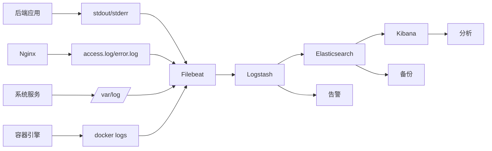

# 日志收集与分析（ELK Stack）配置

## 架构概述

### ELK Stack组件
```
[应用日志] → [Filebeat] → [Logstash] → [Elasticsearch] → [Kibana]
     ↓           ↓           ↓              ↓              ↓
[系统日志]  [容器日志]  [日志过滤/增强]  [日志存储/索引]  [日志可视化]
     ↓           ↓           ↓              ↓              ↓
[Nginx日志] [审计日志]  [告警规则]      [备份/归档]     [仪表板]
```

### 日志流


## 部署配置

### Docker Compose配置
```yaml
# docker-compose.elk.yml
version: '3.8'

services:
  # Elasticsearch集群
  elasticsearch:
    image: docker.elastic.co/elasticsearch/elasticsearch:8.10.0
    container_name: internship-es
    environment:
      - node.name=es01
      - cluster.name=internship-cluster
      - discovery.type=single-node
      - xpack.security.enabled=false
      - "ES_JAVA_OPTS=-Xms4g -Xmx4g"
      - bootstrap.memory_lock=true
    ulimits:
      memlock:
        soft: -1
        hard: -1
    volumes:
      - es_data01:/usr/share/elasticsearch/data
      - ./elasticsearch/config/elasticsearch.yml:/usr/share/elasticsearch/config/elasticsearch.yml
    ports:
      - "9200:9200"
      - "9300:9300"
    networks:
      - elk-network
    healthcheck:
      test: ["CMD", "curl", "-f", "http://localhost:9200"]
      interval: 30s
      timeout: 10s
      retries: 3

  # Logstash
  logstash:
    image: docker.elastic.co/logstash/logstash:8.10.0
    container_name: internship-logstash
    volumes:
      - ./logstash/config/logstash.yml:/usr/share/logstash/config/logstash.yml
      - ./logstash/pipeline:/usr/share/logstash/pipeline
      - ./logs:/var/log/internship
    ports:
      - "5044:5044"  # Beats输入
      - "5000:5000/tcp"  # TCP输入
      - "5000:5000/udp"  # UDP输入
    environment:
      - LS_JAVA_OPTS=-Xms2g -Xmx2g
    networks:
      - elk-network
    depends_on:
      elasticsearch:
        condition: service_healthy

  # Kibana
  kibana:
    image: docker.elastic.co/kibana/kibana:8.10.0
    container_name: internship-kibana
    ports:
      - "5601:5601"
    environment:
      - ELASTICSEARCH_HOSTS=http://elasticsearch:9200
      - SERVER_NAME=internship-kibana
    volumes:
      - ./kibana/config/kibana.yml:/usr/share/kibana/config/kibana.yml
    networks:
      - elk-network
    depends_on:
      elasticsearch:
        condition: service_healthy

  # Filebeat（部署在应用服务器）
  filebeat:
    image: docker.elastic.co/beats/filebeat:8.10.0
    container_name: internship-filebeat
    user: root
    volumes:
      - ./filebeat/filebeat.yml:/usr/share/filebeat/filebeat.yml:ro
      - ./logs:/var/log/internship:ro
      - /var/lib/docker/containers:/var/lib/docker/containers:ro
      - /var/run/docker.sock:/var/run/docker.sock
    networks:
      - elk-network
    depends_on:
      logstash:
        condition: service_started

networks:
  elk-network:
    driver: bridge

volumes:
  es_data01:
    driver: local
```

## 日志配置

### 应用日志配置（Python）
```python
# logging_config.py
import logging
import sys
from pythonjsonlogger import jsonlogger
from logging.handlers import RotatingFileHandler

def setup_logging():
    """配置JSON格式日志"""
    
    # 日志格式
    log_format = '%(asctime)s %(levelname)s %(name)s %(message)s %(filename)s %(funcName)s %(lineno)d'
    json_format = jsonlogger.JsonFormatter(log_format)
    
    # 控制台处理器
    console_handler = logging.StreamHandler(sys.stdout)
    console_handler.setFormatter(json_format)
    console_handler.setLevel(logging.INFO)
    
    # 文件处理器
    file_handler = RotatingFileHandler(
        '/var/log/internship/backend/app.log',
        maxBytes=10485760,  # 10MB
        backupCount=10
    )
    file_handler.setFormatter(json_format)
    file_handler.setLevel(logging.DEBUG)
    
    # Elasticsearch处理器（可选）
    try:
        from cmreslogging.handlers import CMRESHandler
        es_handler = CMRESHandler(
            hosts=[{'host': 'elasticsearch', 'port': 9200}],
            auth_type=CMRESHandler.AuthType.NO_AUTH,
            es_index_name='internship-logs',
            raise_on_indexing_exceptions=True
        )
        es_handler.setFormatter(json_format)
        es_handler.setLevel(logging.INFO)
    except ImportError:
        es_handler = None
    
    # 配置根日志记录器
    root_logger = logging.getLogger()
    root_logger.setLevel(logging.DEBUG)
    root_logger.addHandler(console_handler)
    root_logger.addHandler(file_handler)
    if es_handler:
        root_logger.addHandler(es_handler)
    
    # 特定模块日志级别
    logging.getLogger('urllib3').setLevel(logging.WARNING)
    logging.getLogger('playwright').setLevel(logging.WARNING)
    
    return root_logger

# 结构化日志示例
import structlog

structlog.configure(
    processors=[
        structlog.stdlib.filter_by_level,
        structlog.stdlib.add_logger_name,
        structlog.stdlib.add_log_level,
        structlog.stdlib.PositionalArgumentsFormatter(),
        structlog.processors.TimeStamper(fmt="iso"),
        structlog.processors.StackInfoRenderer(),
        structlog.processors.format_exc_info,
        structlog.processors.JSONRenderer()
    ],
    context_class=dict,
    logger_factory=structlog.stdlib.LoggerFactory(),
    wrapper_class=structlog.stdlib.BoundLogger,
    cache_logger_on_first_use=True,
)

logger = structlog.get_logger()

# 使用结构化日志
logger.info("search_request",
    user_id="user123",
    keywords=["产品经理", "上海"],
    platform="zhipin",
    duration_ms=3200,
    result_count=15)
```

### Nginx日志配置
```nginx
# nginx.conf
http {
    log_format json_combined escape=json
    '{'
        '"timestamp":"$time_iso8601",'
        '"remote_addr":"$remote_addr",'
        '"remote_user":"$remote_user",'
        '"request":"$request",'
        '"status":$status,'
        '"body_bytes_sent":$body_bytes_sent,'
        '"request_time":$request_time,'
        '"upstream_response_time":"$upstream_response_time",'
        '"http_referer":"$http_referer",'
        '"http_user_agent":"$http_user_agent",'
        '"http_x_forwarded_for":"$http_x_forwarded_for",'
        '"server_name":"$server_name",'
        '"request_length":$request_length,'
        '"upstream_addr":"$upstream_addr"'
    '}';
    
    access_log /var/log/nginx/access.log json_combined;
    error_log /var/log/nginx/error.log warn;
    
    # 按日分割日志
    map $time_iso8601 $logdate {
        '~^(?<ymd>\d{4}-\d{2}-\d{2})' $ymd;
        default 'nodate';
    }
    
    access_log /var/log/nginx/access-$logdate.log json_combined;
}
```

## Filebeat配置

### filebeat.yml
```yaml
# filebeat.yml
filebeat.inputs:
  # 应用日志
  - type: filestream
    id: backend-logs
    paths:
      - /var/log/internship/backend/*.log
    fields:
      log_type: "application"
      service: "backend"
      environment: "${ENVIRONMENT:-production}"
    fields_under_root: true
    parsers:
      - ndjson:
          target: ""

  # Nginx访问日志
  - type: filestream
    id: nginx-access
    paths:
      - /var/log/nginx/access*.log
    fields:
      log_type: "nginx_access"
      service: "nginx"
    fields_under_root: true
    parsers:
      - ndjson:
          target: ""
          overwrite_keys: true

  # Nginx错误日志
  - type: filestream
    id: nginx-error
    paths:
      - /var/log/nginx/error.log
    fields:
      log_type: "nginx_error"
      service: "nginx"
    fields_under_root: true

  # 系统日志
  - type: filestream
    id: system-logs
    paths:
      - /var/log/syslog
      - /var/log/auth.log
    fields:
      log_type: "system"
      service: "system"
    fields_under_root: true

  # Docker容器日志
  - type: container
    paths:
      - /var/lib/docker/containers/*/*.log
    stream: all
    fields:
      log_type: "docker"
      service: "container"
    fields_under_root: true
    processors:
      - add_docker_metadata:
          host: "unix:///var/run/docker.sock"

# 处理模块
processors:
  - add_host_metadata:
      when.not.contains.tags: forwarded
  - add_cloud_metadata: ~
  - add_docker_metadata: ~
  - add_kubernetes_metadata: ~
  
  # 删除敏感字段
  - drop_fields:
      fields: ["agent.ephemeral_id", "agent.hostname", "agent.id", "agent.version"]
  
  # 添加业务字段
  - script:
      lang: javascript
      source: >
        function process(event) {
          var message = event.Get("message");
          if (message && message.includes("user_id")) {
            // 提取用户ID
            var match = message.match(/user_id=(\w+)/);
            if (match) {
              event.Put("user.id", match[1]);
            }
          }
          return event;
        }

# 输出到Logstash
output.logstash:
  hosts: ["logstash:5044"]
  compression_level: 3
  bulk_max_size: 4096
  timeout: 30

# 监控
monitoring:
  enabled: true
  logs: true
  metrics:
    enabled: true
    period: 30s

# 日志轮转
logging:
  level: info
  to_files: true
  files:
    path: /var/log/filebeat
    name: filebeat.log
    keepfiles: 7
    permissions: 0644
```

## Logstash管道配置

### pipeline/logstash.conf
```ruby
# 输入配置
input {
  # Filebeat输入
  beats {
    port => 5044
    host => "0.0.0.0"
    ssl => false
  }
  
  # TCP输入（备用）
  tcp {
    port => 5000
    codec => json_lines
    tags => ["tcp_input"]
  }
}

# 过滤器配置
filter {
  # 根据日志类型路由
  if [log_type] == "application" {
    # 应用日志处理
    grok {
      match => { "message" => "%{TIMESTAMP_ISO8601:timestamp} %{LOGLEVEL:level} %{DATA:logger} %{GREEDYDATA:message}" }
      overwrite => ["message"]
    }
    
    # 解析JSON消息
    if [message] =~ /^{.*}$/ {
      json {
        source => "message"
        target => "payload"
      }
    }
    
    # 添加业务标签
    if [payload][keywords] {
      mutate {
        add_field => { "search_keywords" => "%{[payload][keywords]}" }
      }
    }
    
    # 错误日志特殊处理
    if [level] == "ERROR" or [level] == "FATAL" {
      mutate {
        add_tag => ["error_log"]
      }
    }
  }
  
  if [log_type] == "nginx_access" {
    # Nginx访问日志已经是JSON格式
    # 添加地理位置信息
    geoip {
      source => "remote_addr"
      target => "geoip"
      database => "/usr/share/logstash/GeoLite2-City.mmdb"
    }
    
    # 解析User-Agent
    useragent {
      source => "http_user_agent"
      target => "user_agent"
    }
    
    # 状态码分类
    if [status] >= 400 and [status] < 500 {
      mutate {
        add_tag => ["client_error"]
      }
    }
    if [status] >= 500 {
      mutate {
        add_tag => ["server_error"]
      }
    }
  }
  
  if [log_type] == "nginx_error" {
    # Nginx错误日志
    grok {
      match => { "message" => "%{TIMESTAMP_ISO8601:timestamp} \[%{LOGLEVEL:level}\] %{POSINT:pid}#%{NUMBER}: %{GREEDYDATA:error_message}" }
    }
  }
  
  # 通用处理
  # 时间戳处理
  date {
    match => ["timestamp", "ISO8601"]
    target => "@timestamp"
    timezone => "Asia/Shanghai"
  }
  
  # 删除冗余字段
  mutate {
    remove_field => ["@version", "tags", "log_type"]
  }
  
  # 添加索引名称
  mutate {
    add_field => { "[@metadata][index]" => "internship-logs-%{+YYYY.MM.dd}" }
  }
}

# 输出配置
output {
  # 输出到Elasticsearch
  elasticsearch {
    hosts => ["elasticsearch:9200"]
    index => "%{[@metadata][index]}"
    document_type => "_doc"
    template => "/usr/share/logstash/templates/logstash-template.json"
    template_name => "internship-logs"
    template_overwrite => true
    
    # 重试策略
    retry_initial_interval => 2
    retry_max_interval => 64
    max_retries => 5
    
    # 批量设置
    flush_size => 1000
    idle_flush_time => 5
  }
  
  # 调试输出（仅开发环境）
  if [environment] == "development" {
    stdout {
      codec => rubydebug
    }
  }
  
  # 错误日志单独存储
  if "error_log" in [tags] {
    elasticsearch {
      hosts => ["elasticsearch:9200"]
      index => "internship-errors-%{+YYYY.MM.dd}"
    }
  }
}
```

## Kibana仪表板

### 预定义仪表板
| 仪表板 | 用途 | 关键可视化 |
|--------|------|------------|
| 应用性能概览 | 监控应用整体性能 | 请求量、错误率、响应时间 |
| 错误分析 | 分析错误类型和趋势 | 错误分类、错误堆栈、影响用户 |
| 用户行为分析 | 分析用户使用模式 | 用户活跃度、功能使用分布、会话分析 |
| 安全审计 | 监控安全相关事件 | 登录尝试、异常请求、安全事件 |
| 系统资源 | 监控基础设施 | CPU、内存、磁盘、网络使用率 |

### Kibana搜索示例
```json
// 搜索特定用户的日志
{
  "query": {
    "term": {
      "user.id": "user123"
    }
  },
  "sort": [
    {
      "@timestamp": {
        "order": "desc"
      }
    }
  ]
}

// 搜索错误日志
{
  "query": {
    "bool": {
      "must": [
        {
          "match": {
            "level": "ERROR"
          }
        },
        {
          "range": {
            "@timestamp": {
              "gte": "now-1h"
            }
          }
        }
      ]
    }
  }
}

// 聚合分析：按小时统计请求量
{
  "aggs": {
    "requests_per_hour": {
      "date_histogram": {
        "field": "@timestamp",
        "calendar_interval": "hour"
      }
    }
  }
}
```

## 告警配置

### Elasticsearch告警规则
```json
{
  "trigger": {
    "schedule": {
      "interval": "5m"
    }
  },
  "input": {
    "search": {
      "request": {
        "indices": ["internship-logs-*"],
        "body": {
          "size": 0,
          "query": {
            "bool": {
              "must": [
                {
                  "range": {
                    "@timestamp": {
                      "gte": "now-5m"
                    }
                  }
                },
                {
                  "match": {
                    "level": "ERROR"
                  }
                }
              ]
            }
          },
          "aggs": {
            "error_count": {
              "value_count": {
                "field": "level.keyword"
              }
            }
          }
        }
      }
    }
  },
  "condition": {
    "script": {
      "source": "params.results[0].hits.total.value > 10",
      "lang": "painless"
    }
  },
  "actions": {
    "log_error_alert": {
      "webhook": {
        "scheme": "https",
        "host": "alertmanager.example.com",
        "port": 9093,
        "method": "post",
        "path": "/api/v1/alerts",
        "body": {
          "alerts": [
            {
              "labels": {
                "severity": "critical",
                "service": "backend",
                "alertname": "HighErrorRate"
              },
              "annotations": {
                "summary": "错误日志数量异常",
                "description": "5分钟内检测到 {{ctx.results[0].hits.total.value}} 条错误日志"
              }
            }
          ]
        }
      }
    }
  }
}
```

## 日志保留策略

### 保留策略配置
```yaml
# Elasticsearch索引生命周期策略
PUT _ilm/policy/logs-retention-policy
{
  "policy": {
    "phases": {
      "hot": {
        "min_age": "0ms",
        "actions": {
          "rollover": {
            "max_size": "50gb",
            "max_age": "1d"
          },
          "set_priority": {
            "priority": 100
          }
        }
      },
      "warm": {
        "min_age": "1d",
        "actions": {
          "forcemerge": {
            "max_num_segments": 1
          },
          "shrink": {
            "number_of_shards": 1
          },
          "set_priority": {
            "priority": 50
          }
        }
      },
      "cold": {
        "min_age": "7d",
        "actions": {
          "set_priority": {
            "priority": 0
          }
        }
      },
      "delete": {
        "min_age": "30d",
        "actions": {
          "delete": {}
        }
      }
    }
  }
}

# 应用策略到索引模板
PUT _template/internship-logs-template
{
  "index_patterns": ["internship-logs-*"],
  "settings": {
    "number_of_shards": 3,
    "number_of_replicas": 1,
    "index.lifecycle.name": "logs-retention-policy",
    "index.lifecycle.rollover_alias": "internship-logs"
  }
}
```

## 备份与恢复

### 日志备份策略
```bash
#!/bin/bash
# backup-elk-data.sh
#!/bin/bash

# 配置
BACKUP_DIR="/backup/elk"
TIMESTAMP=$(date +%Y%m%d_%H%M%S)
RETENTION_DAYS=30

# 创建快照仓库
curl -X PUT "localhost:9200/_snapshot/elk_backup" -H 'Content-Type: application/json' -d'
{
  "type": "fs",
  "settings": {
    "location": "'${BACKUP_DIR}'/snapshots",
    "compress": true
  }
}'

# 创建快照
curl -X PUT "localhost:9200/_snapshot/elk_backup/snapshot_${TIMESTAMP}?wait_for_completion=true" -H 'Content-Type: application/json' -d'
{
  "indices": "internship-*",
  "ignore_unavailable": true,
  "include_global_state": false
}'

# 清理旧备份
find ${BACKUP_DIR} -name "snapshot_*" -type f -mtime +${RETENTION_DAYS} -delete

echo "备份完成: snapshot_${TIMESTAMP}"
```

## 安全配置

### Elasticsearch安全
```yaml
# elasticsearch.yml
xpack.security.enabled: true
xpack.security.transport.ssl.enabled: true
xpack.security.transport.ssl.verification_mode: certificate
xpack.security.transport.ssl.keystore.path: elastic-certificates.p12
xpack.security.transport.ssl.truststore.path: elastic-certificates.p12
xpack.security.http.ssl.enabled: true
xpack.security.http.ssl.keystore.path: elastic-http.p12

# 用户和角色
# 创建只读用户
bin/elasticsearch-users useradd viewer -p password -r viewer_role

# 创建角色
POST /_security/role/viewer_role
{
  "indices": [
    {
      "names": ["internship-logs-*"],
      "privileges": ["read", "view_index_metadata"]
    }
  ]
}
```

## 监控与维护

### ELK Stack监控指标
| 组件 | 关键指标 | 告警阈值 |
|------|----------|----------|
| Elasticsearch | 集群健康状态 | status != green |
| | JVM堆内存使用率 | >75% |
| | 磁盘使用率 | >85% |
| Logstash | 管道事件数 | 连续5分钟为0 |
| | 管道延迟 | >10秒 |
| Kibana | 响应时间 | P95 > 5秒 |
| | 活跃连接数 | >1000 |

### 维护任务
| 任务 | 频率 | 操作 |
|------|------|------|
| 索引优化 | 每周 | forcemerge、shrink |
| 磁盘空间检查 | 每日 | 监控磁盘使用率 |
| 备份验证 | 每周 | 测试备份恢复 |
| 安全更新 | 每月 | 更新SSL证书、密码 |
| 性能调优 | 每季度 | JVM调优、索引优化 |

## 故障排除

### 常见问题
1. **日志丢失**
   - 检查Filebeat状态
   - 验证Logstash管道
   - 检查Elasticsearch索引

2. **性能下降**
   - 检查磁盘IO
   - 监控JVM内存
   - 优化查询性能

3. **连接问题**
   - 验证网络连接
   - 检查防火墙规则
   - 确认服务端口

### 诊断命令
```bash
# 检查Elasticsearch健康状态
curl http://elasticsearch:9200/_cluster/health?pretty

# 查看索引状态
curl http://elasticsearch:9200/_cat/indices?v

# 检查Logstash管道
curl http://logstash:9600/_node/stats/pipeline?pretty

# 查看Filebeat状态
filebeat test output
filebeat test config
```

## 附录

### 资源需求
| 环境 | Elasticsearch节点 | 内存 | 存储 | 保留期限 |
|------|-------------------|------|------|----------|
| 开发 | 1 | 4GB | 100GB | 7天 |
| 测试 | 2 | 8GB | 500GB | 14天 |
| 生产 | 3 | 16GB | 2TB | 30天 |

### 参考文档
- [Elastic Stack官方文档](https://www.elastic.co/guide/index.html)
- [Filebeat配置参考](https://www.elastic.co/guide/en/beats/filebeat/current/index.html)
- [Logstash最佳实践](https://www.elastic.co/guide/en/logstash/current/index.html)
- [Kibana可视化指南](https://www.elastic.co/guide/en/kibana/current/index.html)