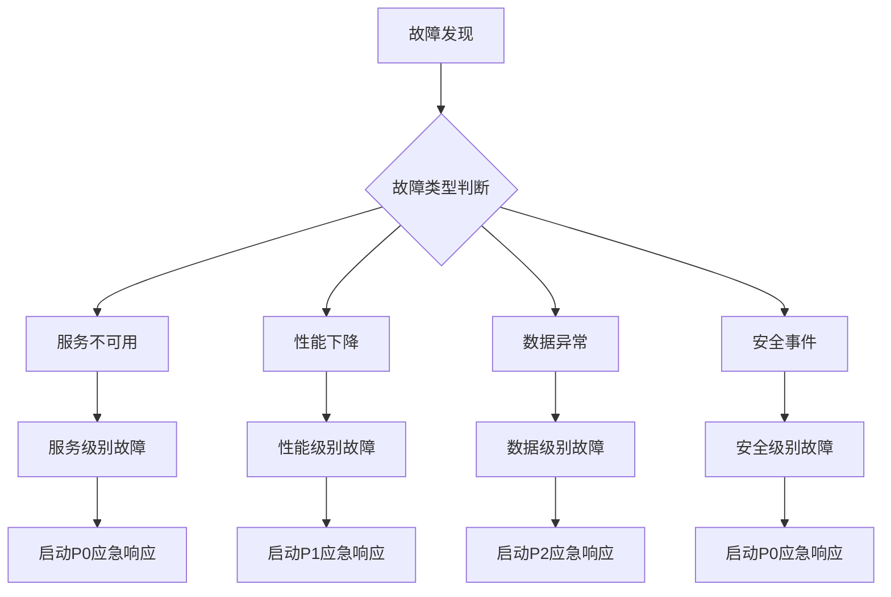

# 应急预案与故障处理流程（OPS-002）

## 概述

本文档定义学生求职AI助手项目的应急预案和故障处理流程，确保在系统故障时能够快速响应和恢复，保障业务连续性。

## 应急响应组织

### 应急响应团队
| 角色 | 职责 | 主要联系人 | 备用联系人 | 联系方式 |
|------|------|------------|------------|----------|
| 应急指挥 | 总体协调决策 | [姓名] | [姓名] | 电话/IM |
| 技术负责人 | 技术方案制定 | [姓名] | [姓名] | 电话/IM |
| 运维工程师 | 故障排查恢复 | [姓名] | [姓名] | 电话/IM |
| 开发工程师 | 代码问题修复 | [姓名] | [姓名] | 电话/IM |
| DBA | 数据库恢复 | [姓名] | [姓名] | 电话/IM |
| 运营人员 | 用户沟通公告 | [姓名] | [姓名] | 电话/IM |

### 响应级别定义
| 级别 | 影响范围 | 响应时间 | 升级条件 | 通知范围 |
|------|----------|----------|----------|----------|
| P0（紧急） | 核心功能不可用，影响所有用户 | ≤15分钟 | 自动升级 | 全体团队+管理层 |
| P1（严重） | 核心功能降级，影响部分用户 | ≤30分钟 | 30分钟未解决 | 技术团队+运营 |
| P2（重要） | 非核心功能问题，影响用户体验 | ≤2小时 | 2小时未解决 | 相关技术团队 |
| P3（一般） | 轻微问题，不影响核心功能 | ≤4小时 | 4小时未解决 | 责任人 |

## 故障分类与响应流程

### 故障分类矩阵


### 通用响应流程
1. **故障发现与报告**
   - 监控告警触发
   - 用户反馈收集
   - 主动巡检发现

2. **故障确认与定级**
   - 初步影响评估
   - 故障级别判定
   - 应急团队通知

3. **应急处置**
   - 紧急缓解措施
   - 根本原因分析
   - 修复方案实施

4. **恢复验证**
   - 功能验证测试
   - 性能指标确认
   - 用户体验验证

5. **事后复盘**
   - 故障原因分析
   - 改进措施制定
   - 文档更新完善

## 典型故障场景应急预案

### 场景一：数据库服务不可用

#### 故障现象
- MySQL服务无法连接
- 应用返回数据库连接错误
- 监控显示数据库连接失败率100%

#### 应急处理步骤
```bash
# 步骤1：确认故障范围
#!/bin/bash
# check_mysql_status.sh
mysqladmin -h mysql -u root -p${MYSQL_ROOT_PASSWORD} ping
mysqladmin -h mysql -u root -p${MYSQL_ROOT_PASSWORD} status
systemctl status mysql

# 步骤2：尝试重启服务
systemctl restart mysql
sleep 10

# 步骤3：检查日志定位问题
tail -n 100 /var/log/mysql/error.log
journalctl -u mysql --since "5 minutes ago"

# 步骤4：如果重启失败，切换到备库
#!/bin/bash
# failover_to_slave.sh
# 停止主库流量
iptables -A INPUT -p tcp --dport 3306 -j DROP

# 提升从库为主库
mysql -h mysql-slave -u root -p${MYSQL_ROOT_PASSWORD} \
    -e "STOP SLAVE; RESET SLAVE ALL;"

# 修改应用配置
sed -i 's/mysql:3306/mysql-slave:3306/g' /app/.env

# 重启应用
systemctl restart internship-backend

# 步骤5：通知团队
send_alert "数据库主从切换完成，请检查业务功能"
```

#### 恢复验证
1. 应用连接测试
2. 核心业务功能测试
3. 数据一致性检查

### 场景二：应用服务性能严重下降

#### 故障现象
- API响应时间P95 > 15秒
- 错误率 > 10%
- 服务器CPU/内存使用率 > 90%

#### 应急处理步骤
```bash
# 步骤1：快速扩容
#!/bin/bash
# scale_up_application.sh
# 增加应用实例
docker service scale internship_backend=4

# 调整负载均衡权重
nginx -s reload

# 步骤2：降级非核心功能
#!/bin/bash
# degrade_non_critical_features.sh
# 关闭爬虫服务
curl -X POST http://backend:8000/admin/disable-crawler

# 关闭问题生成服务
curl -X POST http://backend:8000/admin/disable-question-generation

# 步骤3：清理缓存释放资源
redis-cli -h redis FLUSHDB
systemctl restart redis

# 步骤4：重启有问题的实例
docker ps --filter "name=internship_backend" --format "{{.ID}}" | head -2 | xargs docker restart

# 步骤5：性能分析
#!/bin/bash
# performance_analysis.sh
# 收集性能数据
pid=$(pgrep -f "python main.py")
top -b -n 1 -p $pid
jstack $pid > /tmp/thread_dump_$(date +%s).txt
```

#### 恢复验证
1. 响应时间监控（P95 < 5秒）
2. 错误率监控（< 1%）
3. 资源使用率监控（CPU < 70%）

### 场景三：数据丢失或损坏

#### 故障现象
- 用户数据查询异常
- 数据库表损坏错误
- 数据统计结果异常

#### 应急处理步骤
```bash
# 步骤1：停止数据写入
#!/bin/bash
# stop_data_writes.sh
# 设置数据库只读
mysql -h mysql -u root -p${MYSQL_ROOT_PASSWORD} \
    -e "SET GLOBAL read_only = ON;"

# 停止应用写入操作
systemctl stop internship-backend

# 步骤2：评估数据损坏范围
#!/bin/bash
# assess_data_damage.sh
# 检查表状态
mysqlcheck -h mysql -u root -p${MYSQL_ROOT_PASSWORD} --all-databases

# 验证关键表数据完整性
mysql -h mysql -u root -p${MYSQL_ROOT_PASSWORD} internship_db \
    -e "SELECT COUNT(*) as user_count FROM users; \
        SELECT COUNT(*) as job_count FROM jobs; \
        SELECT COUNT(*) as search_count FROM search_history;"

# 步骤3：执行数据恢复
#!/bin/bash
# execute_data_recovery.sh
# 选择恢复点
BACKUP_DATE=$(date -d "yesterday" +%Y%m%d)

# 执行恢复（见Database_Backup_Recovery.md）
/scripts/mysql_restore.sh $BACKUP_DATE

# 步骤4：数据验证
#!/bin/bash
# verify_recovered_data.sh
# 验证核心业务数据
python /scripts/verify_data_integrity.py

# 步骤5：恢复服务
#!/bin/bash
# resume_service.sh
# 取消只读模式
mysql -h mysql -u root -p${MYSQL_ROOT_PASSWORD} \
    -e "SET GLOBAL read_only = OFF;"

# 启动应用服务
systemctl start internship-backend
```

#### 恢复验证
1. 数据完整性验证
2. 业务逻辑验证
3. 用户数据验证

### 场景四：安全攻击事件

#### 故障现象
- 异常登录尝试频繁
- 数据库注入攻击痕迹
- DDoS攻击导致服务不可用

#### 应急处理步骤
```bash
# 步骤1：隔离攻击源
#!/bin/bash
# isolate_attack_source.sh
# 分析攻击IP
tail -n 1000 /var/log/nginx/access.log | awk '{print $1}' | sort | uniq -c | sort -nr

# 封禁攻击IP
ATTACK_IPS="1.2.3.4 5.6.7.8"
for IP in $ATTACK_IPS; do
    iptables -A INPUT -s $IP -j DROP
    echo "封禁IP: $IP"
done

# 步骤2：增强防护
#!/bin/bash
# enhance_protection.sh
# 启用WAF规则
nginx -s reload

# 调整防火墙策略
ufw --force enable
ufw default deny incoming
ufw allow 443/tcp
ufw allow 80/tcp

# 步骤3：安全审计
#!/bin/bash
# security_audit.sh
# 检查系统日志
grep -i "fail\|error\|invalid\|attack" /var/log/auth.log

# 检查应用日志
grep -i "sql\|injection\|xss\|csrf" /var/log/internship/backend/app.log

# 步骤4：密码重置
#!/bin/bash
# reset_credentials.sh
# 重置数据库密码
mysqladmin -h mysql -u root password "${NEW_MYSQL_PASSWORD}"

# 重置Redis密码
redis-cli -h redis CONFIG SET requirepass "${NEW_REDIS_PASSWORD}"

# 重置应用密钥
sed -i "s/OLD_SECRET_KEY/NEW_SECRET_KEY/g" /app/.env

# 步骤5：恢复服务
#!/bin/bash
# restore_after_attack.sh
# 逐步恢复服务
systemctl restart nginx
systemctl restart internship-backend

# 监控异常行为
tail -f /var/log/nginx/access.log | grep -v "$(echo $ATTACK_IPS | sed 's/ /\\|/g')"
```

#### 恢复验证
1. 安全扫描通过
2. 无异常流量
3. 服务正常访问

## 通信与通知流程

### 紧急通知模板
```markdown
# [紧急/P1/P2/P3] 故障通知

## 故障摘要
- **故障系统**: 学生求职AI助手
- **故障级别**: [P0/P1/P2/P3]
- **发现时间**: YYYY-MM-DD HH:MM:SS
- **影响范围**: [描述影响范围]

## 当前状态
- **状态**: [处理中/已恢复/已解决]
- **处理人员**: [姓名]
- **预计恢复时间**: [时间]

## 影响评估
- **用户影响**: [描述]
- **业务影响**: [描述]
- **数据影响**: [描述]

## 后续更新
- [时间] [更新内容]
```

### 通知渠道矩阵
| 场景 | 即时通讯 | 短信 | 电话 | 邮件 | 公告 |
|------|----------|------|------|------|------|
| P0紧急故障 | ✓ 立即 | ✓ 立即 | ✓ 立即 | ✓ 30分钟内 | ✓ 1小时内 |
| P1严重故障 | ✓ 立即 | ✓ 30分钟内 | - | ✓ 1小时内 | ✓ 2小时内 |
| P2重要故障 | ✓ 30分钟内 | - | - | ✓ 2小时内 | ✓ 4小时内 |
| P3一般故障 | ✓ 2小时内 | - | - | ✓ 4小时内 | - |

## 故障复盘流程

### 复盘会议模板
```markdown
# 故障复盘报告

## 故障基本信息
- **故障ID**: INC-YYYYMMDD-001
- **故障级别**: [P0/P1/P2/P3]
- **发生时间**: YYYY-MM-DD HH:MM:SS
- **恢复时间**: YYYY-MM-DD HH:MM:SS
- **影响时长**: X小时Y分钟
- **影响用户**: 约X人

## 时间线
| 时间 | 事件 | 负责人 |
|------|------|--------|
| HH:MM | 故障发现 | [姓名] |
| HH:MM | 故障确认 | [姓名] |
| HH:MM | 应急响应启动 | [姓名] |
| HH:MM | 缓解措施实施 | [姓名] |
| HH:MM | 根本原因定位 | [姓名] |
| HH:MM | 修复方案实施 | [姓名] |
| HH:MM | 恢复验证 | [姓名] |
| HH:MM | 故障恢复 | [姓名] |

## 根本原因分析
### 直接原因
1. [原因1]
2. [原因2]

### 深层原因
1. [原因1]
2. [原因2]

## 影响评估
### 业务影响
- [影响1]
- [影响2]

### 用户影响
- [影响1]
- [影响2]

### 财务影响
- [影响1]
- [影响2]

## 改进措施
### 短期措施（1周内）
| 措施 | 负责人 | 截止时间 | 状态 |
|------|--------|----------|------|
| [措施1] | [姓名] | YYYY-MM-DD | [待办/进行中/完成] |
| [措施2] | [姓名] | YYYY-MM-DD | [待办/进行中/完成] |

### 长期措施（1个月内）
| 措施 | 负责人 | 截止时间 | 状态 |
|------|--------|----------|------|
| [措施1] | [姓名] | YYYY-MM-DD | [待办/进行中/完成] |
| [措施2] | [姓名] | YYYY-MM-DD | [待办/进行中/完成] |

## 经验教训
1. [教训1]
2. [教训2]

## 参会人员
- [姓名] - [角色]
- [姓名] - [角色]

## 下次复盘时间
YYYY-MM-DD HH:MM
```

## 工具与资源配置

### 应急工具箱
| 工具 | 用途 | 位置 | 负责人 |
|------|------|------|--------|
| 应急响应手册 | 故障处理指南 | Confluence | 运维主管 |
| 一键恢复脚本 | 快速恢复服务 | /scripts/emergency/ | 运维工程师 |
| 监控仪表板 | 实时状态监控 | Grafana | 运维工程师 |
| 通信工具 | 团队协作 | Slack/钉钉 | 应急指挥 |
| 备份恢复工具 | 数据恢复 | /backup/ | DBA |

### 资源准备清单
```bash
# 应急资源检查脚本
#!/bin/bash
# check_emergency_resources.sh

echo "=== 应急资源检查 ==="

# 检查备份文件
echo "1. 数据库备份检查:"
ls -lh /backup/mysql/full/$(date +%Y%m%d)* 2>/dev/null || echo "今日备份未找到"

# 检查监控系统
echo "2. 监控系统检查:"
curl -s http://prometheus:9090/-/healthy | grep "Prometheus" && echo "Prometheus正常" || echo "Prometheus异常"
curl -s http://grafana:3000/api/health | grep "OK" && echo "Grafana正常" || echo "Grafana异常"

# 检查日志系统
echo "3. 日志系统检查:"
curl -s http://elasticsearch:9200/_cluster/health | grep "green\|yellow" && echo "Elasticsearch正常" || echo "Elasticsearch异常"

# 检查应急脚本
echo "4. 应急脚本检查:"
ls -la /scripts/emergency/ | wc -l | xargs echo "应急脚本数量:"

echo "=== 检查完成 ==="
```

## 演练计划

### 定期演练安排
| 演练类型 | 频率 | 参与人员 | 目标 |
|----------|------|----------|------|
| 桌面推演 | 每月 | 核心团队 | 熟悉流程，发现流程问题 |
| 专项演练 | 每季度 | 相关团队 | 验证特定场景处理能力 |
| 综合演练 | 每半年 | 全体团队 | 检验整体应急响应能力 |
| 无预警演练 | 每年 | 全体团队 | 真实检验应急响应能力 |

### 演练评估标准
| 评估维度 | 优秀 | 良好 | 合格 | 不合格 |
|----------|------|------|------|--------|
| 响应时间 | ≤15分钟 | ≤30分钟 | ≤45分钟 | >45分钟 |
| 沟通效率 | 信息准确及时 | 信息基本准确 | 信息有延迟 | 信息混乱 |
| 处理效果 | 完美解决 | 基本解决 | 部分解决 | 未解决 |
| 文档记录 | 完整详细 | 基本完整 | 部分缺失 | 严重缺失 |

## 附录

### 联系人清单
```yaml
应急响应团队:
  应急指挥:
    - 姓名: [姓名]
      电话: [号码]
      IM: [账号]
      邮箱: [邮箱]
    
  技术负责人:
    - 姓名: [姓名]
      电话: [号码]
      IM: [账号]
      邮箱: [邮箱]
  
  第三方服务:
    云服务商:
      - 服务: AWS/阿里云
        支持电话: [号码]
        工单系统: [链接]
    
    域名服务商:
      - 服务: 阿里云DNS
        支持电话: [号码]
        控制台: [链接]
```

### 变更记录
| 日期 | 版本 | 变更内容 | 变更人 | 审核人 |
|------|------|----------|--------|--------|
| 2026-04-11 | 1.0 | 初始版本创建 | Claude | - |
| [日期] | [版本] | [变更描述] | [姓名] | [姓名] |

---

**关联文档**：
- [Phase5_Task_Checklist.md](./Phase5_Task_Checklist.md) - 阶段5任务清单
- [Database_Backup_Recovery.md](./Database_Backup_Recovery.md) - 备份恢复策略
- [Monitoring_Configuration.md](./Monitoring_Configuration.md) - 监控配置
- [User_Feedback_Mechanism.md](./User_Feedback_Mechanism.md) - 用户反馈机制