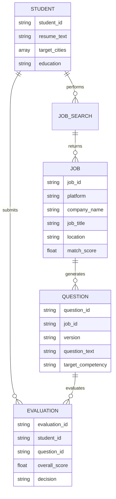

# 学生求职AI助手 - 知识库与数据需求文档

**版本**：v1.0 MVP  
**日期**：2026-04-11  
**状态**：初稿

---

## 知识库范围

### 1.1 知识库架构
```
知识库/
├── 岗位模板库/           # 常见岗位JD模板与关键词
├── 技能映射库/           # 技能关键词关联与扩展
├── 面试问题库/           # 按岗位分类的面试问题模板
├── 公司信息库/           # 目标公司基本信息与招聘偏好
├── 评估标准库/           # 评分维度与参考标准
└── 城市代码库/           # 招聘平台城市代码映射
```

### 1.2 知识库分类说明

| 知识库名称 | 用途 | 优先级 | 数据量估算 |
|------------|------|--------|------------|
| 岗位模板库 | 节点1关键词扩展、节点3问题生成 | P0 | 20-30个岗位类型 |
| 技能映射库 | 节点1关键词扩展、节点4评估匹配 | P0 | 500+技能词条 |
| 面试问题库 | 节点3问题生成参考 | P1 | 200+问题模板 |
| 公司信息库 | 节点2岗位展示、节点4背景参考 | P1 | 100+目标公司 |
| 评估标准库 | 节点4评分依据 | P0 | 4维度评分细则 |
| 城市代码库 | 节点2爬虫参数构造 | P0 | 50+城市 |

---

## 素材库 / 规则库 / FAQ库 / 案例库设计

### 2.1 岗位模板库（Job Template Library）

#### 数据结构
```json
{
  "job_type": "产品经理",
  "aliases": ["产品助理", "产品专员", "产品实习生"],
  "category": "互联网产品",
  "required_skills": ["Axure", "XMind", "数据分析"],
  "optional_skills": ["SQL", "Python", "Figma"],
  "key_competencies": ["需求分析", "原型设计", "项目管理"],
  "typical_jd_patterns": [
    "负责产品需求分析和文档撰写",
    "与设计、开发团队沟通协作"
  ],
  "interview_focus": ["项目经历", "产品思维", "数据分析能力"]
}
```

#### 覆盖岗位列表（MVP版）
| 岗位类型 | 别名 | 核心技能 |
|----------|------|----------|
| 产品经理 | 产品助理/专员 | Axure、数据分析、文档撰写 |
| 前端开发 | 前端工程师/Web开发 | React、Vue、JavaScript |
| 后端开发 | 服务端开发/Java开发 | Java、Python、MySQL |
| 数据分析 | 数据分析师/BI | SQL、Excel、Python、可视化 |
| 运营 | 产品运营/用户运营 | 活动策划、数据分析、文案 |
| UI设计 | 视觉设计/交互设计 | Figma、Sketch、PS |
| 算法工程师 | 机器学习工程师 | Python、机器学习、深度学习 |
| 测试工程师 | QA/质量保障 | 测试用例、自动化测试 |
| 人力资源 | HR/招聘专员 | 招聘流程、沟通协调 |
| 市场营销 | 市场专员/品牌 | 营销策划、文案、数据分析 |

### 2.2 技能映射库（Skill Mapping Library）

#### 数据结构
```json
{
  "skill": "Axure",
  "category": "原型设计",
  "aliases": ["原型设计", "线框图", "低保真", "RP"],
  "related_skills": ["Figma", "Sketch", "墨刀"],
  "related_keywords": ["PRD", "需求文档", "交互设计"],
  "frequency": "high"
}
```

#### 技能分类示例
| 技能类别 | 示例技能 | 关联词 |
|----------|----------|--------|
| 原型设计 | Axure、Figma、Sketch、墨刀 | 线框图、PRD、交互设计 |
| 前端框架 | React、Vue、Angular | 组件化、hooks、SPA |
| 后端语言 | Java、Python、Go、Node.js | Spring、Django、微服务 |
| 数据库 | MySQL、Redis、MongoDB | SQL、NoSQL、缓存 |
| 数据分析 | Excel、SQL、Python、Tableau | 数据可视化、BI、统计 |
| 项目管理 | Jira、Confluence、TAPD | 敏捷、Scrum、看板 |
| 协作工具 | 飞书、钉钉、企业微信 | 协同办公、OKR |

### 2.3 面试问题库（Interview Question Library）

#### 数据结构
```json
{
  "question_id": "PM_001",
  "job_type": "产品经理",
  "version": "general",
  "type": "技能",
  "question": "请描述你如何使用Axure完成一个功能的原型设计？",
  "target_competency": "原型设计能力",
  "key_points": ["工具使用", "设计思路", "迭代过程"],
  "difficulty": "medium",
  "estimated_time": "3-5分钟"
}
```

#### 问题分类矩阵
| 岗位 | 一般版问题类型 | 高阶版问题类型 |
|------|----------------|----------------|
| 产品经理 | 原型工具使用、需求文档撰写、基础数据分析 | 产品规划、增长策略、跨团队推动 |
| 前端开发 | 组件开发、框架使用、调试技巧 | 性能优化、架构设计、技术选型 |
| 数据分析 | SQL查询、Excel分析、报表制作 | 指标体系、AB测试、商业洞察 |
| 运营 | 活动策划、文案撰写、数据监控 | 用户增长、运营策略、预算管理 |

### 2.4 公司信息库（Company Information Library）

#### 数据结构
```json
{
  "company_name": "字节跳动",
  "aliases": ["ByteDance", "头条", "抖音"],
  "industry": "互联网",
  "scale": "10000+",
  "location": ["北京", "上海", "深圳", "杭州"],
  "recruitment_focus": ["算法", "产品", "运营"],
  "interview_style": "技术深挖+项目追问",
  "work_culture": "快节奏、结果导向"
}
```

#### 目标公司列表（MVP版）
| 公司 | 行业 | 主要城市 | 校招特点 |
|------|------|----------|----------|
| 字节跳动 | 互联网 | 北上深杭 | 重视算法、产品思维 |
| 阿里巴巴 | 互联网 | 北上杭 | 重视价值观、项目深度 |
| 腾讯 | 互联网 | 深圳 | 重视技术基础、综合能力 |
| 美团 | 互联网 | 北京 | 重视业务理解、执行力 |
| 百度 | 互联网 | 北上深 | 重视技术深度、AI能力 |
| 京东 | 电商 | 北京 | 重视业务思维、抗压能力 |
| 快手 | 互联网 | 北京 | 重视增长思维、数据敏感 |
| 拼多多 | 电商 | 上海 | 重视执行效率、结果导向 |

### 2.5 评估标准库（Evaluation Criteria Library）

#### 评分维度细则
| 维度 | 权重 | 评分标准（10分制） |
|------|------|-------------------|
| 岗位技能覆盖度 | 30% | 回答中提及JD要求核心关键词的数量和深度 |
| 案例具体性 | 25% | 是否有具体项目/场景/背景描述，而非泛泛而谈 |
| 逻辑表达 | 25% | 结构是否清晰（STAR法则）、论述是否有条理 |
| 量化成果 | 20% | 是否包含具体数据、指标、效果描述 |

#### 各维度评分细则
**岗位技能覆盖度**
- 10分：完整覆盖所有核心技能要求，并有深入展开
- 7-9分：覆盖主要技能要求，有一定深度
- 4-6分：覆盖部分技能，深度不足
- 1-3分：几乎未提及相关技能

**案例具体性**
- 10分：有明确的项目名称、背景、具体任务
- 7-9分：有项目背景和任务描述，但不够具体
- 4-6分：只有简单提及，缺乏细节
- 1-3分：完全无具体案例，纯理论表述

**逻辑表达**
- 10分：完整的STAR结构（背景-任务-行动-结果），逻辑严密
- 7-9分：有基本结构，部分环节可更清晰
- 4-6分：结构松散，逻辑跳跃
- 1-3分：无结构，混乱堆砌

**量化成果**
- 10分：包含具体数字指标（如"提升30%"）
- 7-9分：有定性描述+少量数据
- 4-6分：只有定性描述，无数据
- 1-3分：连定性成果都未说明

### 2.6 城市代码库（City Code Library）

#### 各平台城市代码映射
```json
{
  "城市": "上海",
  "BOSS直聘": "101020100",
  "猎聘": "020",
  "智联招聘": "538",
  "前程无忧": "020000"
}
```

#### 主要城市代码表
| 城市 | BOSS直聘 | 猎聘 | 智联 | 51job |
|------|----------|------|------|-------|
| 北京 | 101010100 | 010 | 530 | 010000 |
| 上海 | 101020100 | 020 | 538 | 020000 |
| 广州 | 101280100 | 050020 | 763 | 030200 |
| 深圳 | 101280600 | 050090 | 765 | 040000 |
| 杭州 | 101210100 | 070020 | 653 | 080200 |
| 成都 | 101270100 | 090020 | 801 | 090200 |
| 武汉 | 101200100 | 170020 | 736 | 180200 |
| 南京 | 101190100 | 060020 | 635 | 070200 |
| 西安 | 101110100 | 200020 | 854 | 200200 |
| 苏州 | 101190400 | 060080 | 639 | 070300 |

---

## 数据字段与实体关系

### 3.1 核心实体定义

#### 用户（Student）
```json
{
  "student_id": "唯一标识",
  "session_id": "会话标识",
  "resume_text": "简历文本内容",
  "resume_skills": ["技能列表"],
  "target_job_type": "目标岗位类型",
  "target_cities": ["目标城市"],
  "education": "学历",
  "graduation_year": "毕业年份"
}
```

#### 岗位（Job）
```json
{
  "job_id": "MD5(公司+岗位+地点)",
  "platform": "平台来源",
  "company_name": "公司名",
  "job_title": "岗位名称",
  "job_category": "岗位类别",
  "location": "工作地点",
  "salary_min": "薪资下限",
  "salary_max": "薪资上限",
  "salary_unit": "薪资单位（天/月/年）",
  "jd_text": "职位描述全文",
  "jd_url": "详情页链接",
  "publish_time": "发布时间",
  "crawl_time": "爬取时间",
  "match_score": "匹配度评分",
  "match_details": "匹配度详情"
}
```

#### 问题（Question）
```json
{
  "question_id": "唯一标识",
  "job_id": "关联岗位ID",
  "version": "版本（general/advanced）",
  "type": "问题类型",
  "question_text": "问题内容",
  "target_competency": "考察能力",
  "jd_reference": "JD原文依据",
  "difficulty": "难度等级"
}
```

#### 评估记录（Evaluation）
```json
{
  "evaluation_id": "唯一标识",
  "student_id": "学生ID",
  "question_id": "问题ID",
  "answer_text": "学生回答",
  "scores": {
    "overall": "综合分",
    "skill_coverage": "技能覆盖度",
    "specificity": "案例具体性",
    "logic": "逻辑表达",
    "quantification": "量化成果"
  },
  "keyword_matches": "关键词匹配详情",
  "strengths": "亮点列表",
  "improvements": "改进建议",
  "decision": "决策结果",
  "created_at": "创建时间"
}
```

### 3.2 实体关系图


---

## 更新机制与维护责任人

### 4.1 更新频率

| 知识库 | 更新频率 | 触发条件 | 维护责任人 |
|--------|----------|----------|------------|
| 岗位模板库 | 季度 | 新增热门岗位类型 | 知识库运营 |
| 技能映射库 | 月度 | 新技术/工具出现 | 技术运营 |
| 面试问题库 | 月度 | 收集用户反馈 | 内容运营 |
| 公司信息库 | 季度 | 校招季前更新 | 内容运营 |
| 评估标准库 | 半年度 | 算法优化后 | 算法工程师 |
| 城市代码库 | 按需 | 平台代码变更 | 开发工程师 |

### 4.2 更新流程
```
1. 数据收集
   └─ 爬虫监控 / 用户反馈 / 人工审核

2. 内容审核
   └─ 准确性校验 / 相关性判断 / 质量评估

3. 知识入库
   └─ 格式标准化 / 关联关系建立 / 版本标记

4. 效果验证
   └─ A/B测试 / 抽样评估 / 用户满意度

5. 全量上线
   └─ 灰度发布 / 监控告警 / 回滚预案
```

### 4.3 版本管理
- 所有知识库条目需包含版本号和更新时间戳
- 支持历史版本回滚
- 重大更新需进行影响评估

---

## 权限控制策略

### 5.1 数据访问权限

| 数据类型 | 存储方式 | 访问控制 | 保留期限 |
|----------|----------|----------|----------|
| 学生简历 | 内存/临时文件 | 仅当前会话可用 | 会话结束即清除 |
| 爬取岗位数据 | 缓存数据库 | 内部服务访问 | 7天 |
| 评估记录 | 业务数据库 | 学生本人+管理员 | 90天 |
| 知识库数据 | 向量数据库 | 内部服务只读 | 长期 |
| 系统日志 | 日志系统 | 运维人员 | 30天 |

### 5.2 隐私保护措施
- **简历内容**：仅用于本次会话分析，不持久化存储，不用于模型训练
- **个人信息**：爬取数据中如涉及HR联系方式等个人隐私，脱敏处理后展示
- **搜索记录**：匿名化处理后用于统计分析
- **评估内容**：学生可选择是否保存，默认不保存

---

## RAG切片、召回、重排建议

### 6.1 知识库向量化

#### 切片策略
| 知识库 | 切片单位 | 切片大小 | 重叠策略 |
|--------|----------|----------|----------|
| 岗位模板库 | 单岗位文档 | 512 tokens | 无 |
| 技能映射库 | 单技能条目 | 256 tokens | 无 |
| 面试问题库 | 单问题 | 128 tokens | 无 |
| JD文本 | 段落 | 512 tokens | 50 tokens重叠 |

#### 向量化模型
- **推荐**：sentence-transformers/all-MiniLM-L6-v2（轻量）
- **备选**：text-embedding-ada-002（OpenAI，效果更优但需成本）

### 6.2 召回策略

#### 节点1（关键词生成）召回
- 查询：学生输入的岗位意向
- 召回源：岗位模板库 + 技能映射库
- 召回数量：TOP5相关岗位类型 + TOP10相关技能
- 相似度阈值：≥0.6

#### 节点3（问题生成）召回
- 查询：JD关键句 + 学生简历
- 召回源：面试问题库
- 召回数量：TOP10相似问题作为生成参考
- 相似度阈值：≥0.5

#### 节点4（评估）召回
- 查询：学生回答内容
- 召回源：JD技能要求 + 评估标准库
- 召回数量：全部JD要求（用于关键词匹配）
- 用途：关键词匹配与评分依据

### 6.3 重排策略
- **粗排**：向量相似度排序
- **精排**：结合业务规则（如技能匹配度、岗位热度）
- **去重**：基于内容相似度去重（阈值0.9）

---

## 数据质量要求与脱敏要求

### 7.1 数据质量要求

| 质量维度 | 要求 | 检测方法 |
|----------|------|----------|
| 完整性 | 必填字段无缺失 | 自动化校验 |
| 准确性 | 信息真实可靠 | 抽样人工审核 |
| 时效性 | 岗位数据7天内 | 发布时间校验 |
| 一致性 | 同一实体描述一致 | 实体对齐检测 |
| 规范性 | 符合预设格式 | 格式校验规则 |

### 7.2 脱敏要求

#### 需脱敏字段
| 字段 | 脱敏方式 | 示例 |
|------|----------|------|
| HR姓名 | 完全隐藏 | 张** |
| HR电话 | 完全隐藏 | 1********** |
| HR邮箱 | 部分隐藏 | hr***@company.com |
| 公司内部门 | 泛化处理 | "商业产品部"→"产品部门" |
| 具体项目名 | 泛化处理 | "抖音电商"→"电商业务" |

#### 合规要求
- 遵守《个人信息保护法》
- 遵守各招聘平台服务条款
- 仅展示公开可见的招聘信息
- 不采集非公开的内部信息

---

## 版本记录

| 版本 | 日期 | 修改内容 |
|------|------|----------|
| v1.0 MVP | 2026-04-11 | 初始版本，基于母模板框架创建 |

---

## 推导项与假设项汇总

| 内容 | 类型 | 说明 |
|------|------|------|
| 20个MVP岗位类型 | 推导项 | 覆盖主流实习岗位 |
| 500+技能词条 | 推导项 | 基于常见技术栈估算 |
| 7天数据保留期 | 假设项 | 平衡新鲜度与性能 |
| sentence-transformers向量化 | 假设项 | 开源方案 |
| 90天评估记录保留 | 假设项 | 满足学生复盘需求 |
