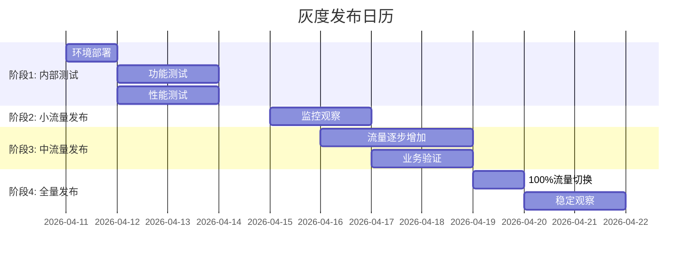

# 灰度发布计划

## 发布概述
| 项目 | 内容 |
|------|------|
| 应用名称 | 学生求职AI助手 |
| 发布版本 | v1.0.0 |
| 发布时间 | 2026年4月第3周 |
| 发布负责人 | 张三（运维） |
| 回滚负责人 | 李四（开发） |
| 监控负责人 | 王五（运维） |

## 发布阶段

### 阶段1：内部测试（第1-3天）
| 项目 | 内容 |
|------|------|
| 目标 | 验证功能完整性，确保无阻断性缺陷 |
| 范围 | 内部测试团队（10人） |
| 验证重点 | 核心业务流程、数据一致性 |
| 成功标准 | 测试报告通过，无P0级缺陷 |

### 阶段2：小流量发布（5%用户，第4-6天）
| 项目 | 内容 |
|------|------|
| 目标 | 验证生产环境稳定性，收集真实用户反馈 |
| 范围 | 5%真实用户（约50用户/天） |
| 流量控制 | 基于用户ID哈希，负载均衡器配置 |
| 验证重点 | 系统性能、错误率、用户体验 |
| 成功标准 | 错误率<1%，响应时间达标，用户满意度≥4/5 |

### 阶段3：中流量发布（20%用户，第7-9天）
| 项目 | 内容 |
|------|------|
| 目标 | 扩大验证范围，测试系统承载能力 |
| 范围 | 20%真实用户（约200用户/天） |
| 流量控制 | 逐步增加流量比例，每12小时增加5% |
| 验证重点 | 并发性能、资源使用、业务指标 |
| 成功标准 | 用户满意度≥4/5，无重大故障，业务指标正常 |

### 阶段4：全量发布（100%用户，第10天）
| 项目 | 内容 |
|------|------|
| 目标 | 所有用户切换至新版本 |
| 范围 | 100%真实用户（约1000用户/天） |
| 流量控制 | 一次性切换或分批次切换 |
| 验证重点 | 整体稳定性、监控告警、用户反馈 |
| 成功标准 | 核心业务指标正常，平稳过渡 |

## 流量控制策略

### 基于用户ID的流量分发
```nginx
# Nginx配置示例
split_clients "${remote_addr}${http_user_agent}" $app_version {
    5%     v1.0.0;     # 小流量阶段
    20%    v1.0.0;     # 中流量阶段
    *      v0.9.0;     # 稳定版本
}

location / {
    if ($app_version = "v1.0.0") {
        proxy_pass http://backend_v1;
    }
    if ($app_version = "v0.9.0") {
        proxy_pass http://backend_stable;
    }
}
```

### 基于Cookie的流量控制
```javascript
// 前端流量控制逻辑
function getReleaseVersion() {
    const cookie = getCookie('release_version');
    if (cookie) return cookie;
    
    // 新用户按比例分配
    const random = Math.random() * 100;
    let version = 'v0.9.0'; // 稳定版
    
    if (random < 5) {
        version = 'v1.0.0'; // 5%流量
    } else if (random < 20) {
        version = 'v1.0.0'; // 15%额外流量（累计20%）
    }
    
    setCookie('release_version', version, 30); // 30天有效期
    return version;
}
```

## 监控指标

### 关键监控指标阈值
| 指标 | 警告阈值 | 严重阈值 | 监控频率 | 负责人 |
|------|----------|----------|----------|--------|
| 系统可用性 | <99.5% | <99% | 实时 | 运维 |
| 错误率 | >2% | >5% | 5分钟 | 运维 |
| 响应时间(P95) | >8s | >15s | 5分钟 | 运维 |
| 搜索成功率 | <85% | <70% | 5分钟 | 开发 |
| 爬虫成功率 | <80% | <60% | 5分钟 | 开发 |
| 用户满意度 | <4.0/5.0 | <3.5/5.0 | 每日 | 产品 |

### 业务指标监控
| 指标 | 基线值 | 预期变化 | 监控频率 |
|------|--------|----------|----------|
| 日活跃用户数(DAU) | 1000 | ±20% | 每日 |
| 会话完成率 | 60% | ±10% | 每日 |
| 平均会话深度 | 2.5 | ±0.5 | 每日 |
| 功能使用分布 | [见详情] | 稳定 | 每日 |

## 回滚机制

### 回滚触发条件
| 条件 | 严重程度 | 自动回滚 | 手动确认 |
|------|----------|----------|----------|
| 系统可用性<95%超过5分钟 | P0 | 是 | 是 |
| 错误率>10%超过10分钟 | P0 | 是 | 是 |
| 数据库连接失败超过3分钟 | P1 | 否 | 是 |
| 用户投诉率>5% | P1 | 否 | 是 |
| 核心功能不可用 | P0 | 是 | 是 |

### 回滚步骤
```bash
#!/bin/bash
# rollback.sh
#!/bin/bash
echo "开始回滚到v0.9.0..."

# 1. 停止新版本服务
docker-compose -f docker-compose.prod.yml stop backend_v1 frontend_v1

# 2. 启动旧版本服务
docker-compose -f docker-compose.prod.yml start backend_stable frontend_stable

# 3. 更新负载均衡配置
cp nginx/conf.d/stable.conf nginx/conf.d/internship.conf

# 4. 重载Nginx
docker exec internship_nginx_prod nginx -s reload

# 5. 发送通知
send_notification "系统已回滚到v0.9.0，原因：$1"

echo "回滚完成"
```

### 回滚检查清单
- [ ] 确认旧版本镜像可用
- [ ] 准备回滚脚本并测试
- [ ] 配置自动回滚阈值
- [ ] 准备回滚通知模板
- [ ] 安排回滚值班人员

## 通信计划

### 内部沟通
| 时间 | 受众 | 内容 | 渠道 |
|------|------|------|------|
| 发布前1周 | 所有相关人员 | 发布计划评审 | 会议 |
| 发布前1天 | 运维、开发、测试 | 最终检查确认 | 站会 |
| 发布当天 | 运维团队 | 发布开始通知 | 钉钉群 |
| 每4小时 | 相关干系人 | 发布进度更新 | 邮件 |
| 发布完成 | 所有相关人员 | 发布完成通知 | 全员邮件 |

### 用户通知
| 用户群体 | 通知时间 | 通知内容 | 渠道 |
|----------|----------|----------|------|
| 小流量用户 | 发布时 | 新功能体验邀请 | 应用内通知 |
| 全体用户 | 全量发布前 | 新版本功能介绍 | 应用推送、邮件 |
| 受影响用户 | 出现问题 | 问题说明和解决方案 | 应用内通知 |

## 风险评估与应对

### 技术风险
| 风险 | 概率 | 影响 | 应对措施 |
|------|------|------|----------|
| 数据库性能瓶颈 | 中 | 高 | 1. 优化查询 2. 增加索引 3. 读写分离 |
| 爬虫被限制 | 高 | 高 | 1. 多平台备份 2. 降低请求频率 3. 代理IP池 |
| 第三方API不稳定 | 中 | 中 | 1. 增加重试 2. 本地缓存 3. 降级方案 |
| 内存泄漏 | 低 | 高 | 1. 内存监控 2. 自动重启 3. 定期巡检 |

### 业务风险
| 风险 | 概率 | 影响 | 应对措施 |
|------|------|------|----------|
| 用户流失 | 中 | 高 | 1. 灰度发布 2. 快速回滚 3. 用户补偿 |
| 数据不一致 | 低 | 高 | 1. 数据校验 2. 实时监控 3. 修复脚本 |
| 负面反馈 | 中 | 中 | 1. 及时响应 2. 问题修复 3. 用户沟通 |

## 资源准备

### 人力资源
| 角色 | 姓名 | 职责 | 联系方式 |
|------|------|------|----------|
| 发布经理 | 张三 | 整体协调 | 13800138000 |
| 开发支持 | 李四 | 代码支持 | 13900139000 |
| 运维支持 | 王五 | 部署监控 | 13700137000 |
| 测试支持 | 赵六 | 验证测试 | 13600136000 |
| 产品支持 | 钱七 | 用户反馈 | 13500135000 |

### 环境资源
| 环境 | 服务器 | 数据库 | 状态 |
|------|--------|--------|------|
| 生产环境 | 4核8G×2 | MySQL 8.0 | 就绪 |
| 预发环境 | 2核4G×1 | MySQL 8.0 | 就绪 |
| 回滚环境 | 4核8G×2 | MySQL 8.0 | 就绪 |

### 工具准备
| 工具 | 用途 | 状态 |
|------|------|------|
| 部署脚本 | 自动化部署 | 就绪 |
| 监控平台 | 实时监控 | 就绪 |
| 告警系统 | 异常通知 | 就绪 |
| 日志分析 | 问题排查 | 就绪 |

## 发布检查清单

### 发布前检查（D-1天）
- [ ] 所有代码已合并到发布分支
- [ ] 单元测试和集成测试通过
- [ ] 性能测试报告评审通过
- [ ] 安全扫描无高危漏洞
- [ ] 数据库迁移脚本准备就绪
- [ ] 配置文件已更新
- [ ] 监控告警配置完成
- [ ] 回滚方案测试通过
- [ ] 发布文档已评审
- [ ] 相关人员已通知

### 发布日检查（D-Day）
- [ ] 服务器资源充足
- [ ] 数据库备份完成
- [ ] 负载均衡器配置就绪
- [ ] 发布脚本权限正确
- [ ] 监控仪表板正常
- [ ] 沟通渠道畅通
- [ ] 值班人员就位
- [ ] 用户通知准备

### 发布后检查（D+1天）
- [ ] 核心指标正常
- [ ] 错误率在可控范围
- [ ] 用户反馈收集
- [ ] 监控告警处理
- [ ] 性能数据收集
- [ ] 发布总结会议
- [ ] 文档更新

## 附录

### 发布日历


### 联系方式
| 场景 | 联系方式 | 响应时间 |
|------|----------|----------|
| 紧急故障 | 400-123-4567 | 7x24小时 |
| 技术支持 | support@example.com | 工作日9:00-18:00 |
| 用户反馈 | feedback@example.com | 24小时内响应 |
| 监控告警 | alert@example.com | 实时 |

### 发布记录模板
```markdown
# 发布记录 v1.0.0

## 基本信息
- 发布时间：2026-04-14 02:00 UTC+8
- 发布人：张三
- 发布方式：灰度发布

## 发布内容
1. 新增意向解析算法
2. 优化岗位搜索性能
3. 改进问题生成质量
4. 增强评估准确性

## 监控数据
- 错误率：0.8%
- 响应时间(P95)：9.2s
- 用户满意度：4.3/5.0

## 问题记录
1. 问题：搜索响应时间偶尔超过15s
   解决：优化爬虫并发数
   状态：已解决

## 总结
发布成功，核心功能正常，需持续优化搜索性能。
```