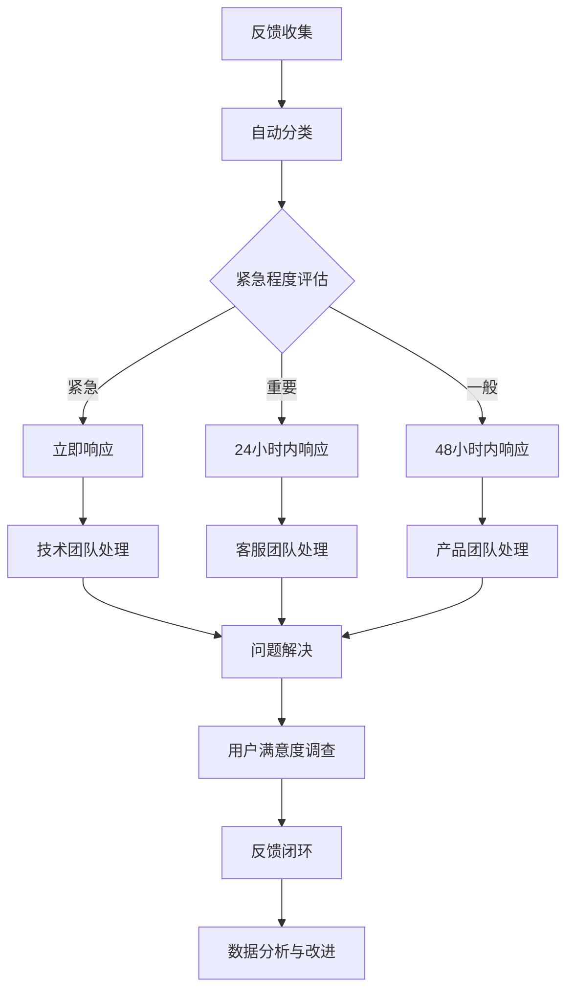

# 用户反馈收集与响应机制（OPS-003）

## 概述

本文档定义学生求职AI助手项目的用户反馈收集、处理、分析和响应机制，确保用户问题得到及时有效解决，持续改进产品体验。

## 反馈渠道

### 多渠道收集矩阵
| 渠道 | 类型 | 适用场景 | 响应时间 | 负责人 |
|------|------|----------|----------|--------|
| 应用内反馈 | 嵌入式表单 | 使用中问题、功能建议 | ≤24小时 | 产品团队 |
| 客服邮箱 | 电子邮件 | 正式问题、投诉建议 | ≤12小时 | 客服团队 |
| 在线聊天 | 即时通讯 | 紧急问题、使用咨询 | ≤1小时 | 客服团队 |
| 用户社区 | 论坛讨论 | 功能讨论、经验分享 | ≤48小时 | 社区经理 |
| 社交媒体 | 微博/微信 | 品牌互动、舆情监控 | ≤4小时 | 运营团队 |
| 应用商店 | 评分评论 | 版本反馈、口碑管理 | ≤24小时 | 产品团队 |

### 渠道配置详情

#### 1. 应用内反馈表单
```html
<!-- 反馈表单组件 -->
<div class="feedback-widget">
    <h3>问题反馈与建议</h3>
    <form id="feedback-form" action="/api/v1/feedback/submit" method="POST">
        <input type="hidden" name="user_id" id="user-id">
        <input type="hidden" name="page_url" id="page-url">
        <input type="hidden" name="user_agent" id="user-agent">
        
        <div class="form-group">
            <label for="feedback-type">反馈类型 *</label>
            <select id="feedback-type" name="type" required>
                <option value="">请选择</option>
                <option value="bug">功能问题/错误</option>
                <option value="suggestion">功能建议</option>
                <option value="uiux">界面体验</option>
                <option value="performance">性能问题</option>
                <option value="content">内容问题</option>
                <option value="other">其他</option>
            </select>
        </div>
        
        <div class="form-group">
            <label for="feedback-content">详细描述 *</label>
            <textarea id="feedback-content" name="content" rows="5" required 
                placeholder="请详细描述您遇到的问题或建议..."></textarea>
        </div>
        
        <div class="form-group">
            <label for="contact-email">联系邮箱</label>
            <input type="email" id="contact-email" name="contact_email" 
                placeholder="如需回复请填写邮箱">
        </div>
        
        <div class="form-group">
            <label for="screenshot">截图上传</label>
            <input type="file" id="screenshot" name="screenshot" accept="image/*">
        </div>
        
        <button type="submit" class="btn-submit">提交反馈</button>
    </form>
</div>
```

#### 2. 客服邮箱配置
```yaml
# 邮箱服务配置
support_email:
  address: "support@internship-ai.example.com"
  smtp_server: "smtp.example.com"
  smtp_port: 587
  username: "support@internship-ai.example.com"
  password: "${EMAIL_PASSWORD}"
  
  # 自动回复配置
  auto_reply:
    enabled: true
    subject: "已收到您的反馈"
    template: |
      尊敬的{user_name}：
      
      您好！我们已经收到您的反馈，感谢您对学生求职AI助手的关注与支持。
      
      反馈内容：{feedback_content}
      反馈类型：{feedback_type}
      提交时间：{submit_time}
      
      我们的团队将在24小时内处理您的反馈，并通过此邮箱与您联系。
      
      祝您使用愉快！
      
      学生求职AI助手团队
      {current_date}
```

#### 3. 在线聊天集成
```javascript
// 在线聊天插件配置
window.IntercomSettings = {
    app_id: "your_app_id",
    name: "{{ user.name }}",
    email: "{{ user.email }}",
    user_id: "{{ user.id }}",
    created_at: "{{ user.created_at }}",
    custom_launcher_selector: '.intercom-button',
    hide_default_launcher: false,
    alignment: 'right',
    horizontal_padding: 20,
    vertical_padding: 20
};

// 或使用自定义解决方案
class FeedbackChat {
    constructor() {
        this.endpoint = '/api/v1/feedback/chat';
        this.isOpen = false;
        this.init();
    }
    
    init() {
        // 创建聊天窗口
        this.createChatWidget();
        this.bindEvents();
    }
    
    createChatWidget() {
        const widget = `
            <div class="chat-widget">
                <div class="chat-header">
                    <span>在线客服</span>
                    <button class="close-chat">×</button>
                </div>
                <div class="chat-messages"></div>
                <div class="chat-input">
                    <input type="text" placeholder="请输入您的问题...">
                    <button class="send-btn">发送</button>
                </div>
            </div>
        `;
        document.body.insertAdjacentHTML('beforeend', widget);
    }
}
```

## 反馈处理流程

### 标准化处理流程


### 反馈分类规则
| 类别 | 子类 | 处理优先级 | 响应时限 | 负责人 |
|------|------|------------|----------|--------|
| 功能问题 | 功能不可用 | P0 | 2小时 | 技术团队 |
| | 功能异常 | P1 | 12小时 | 技术团队 |
| | 功能建议 | P2 | 48小时 | 产品团队 |
| 性能问题 | 页面加载慢 | P1 | 12小时 | 技术团队 |
| | 搜索无结果 | P1 | 12小时 | 技术团队 |
| | 响应超时 | P0 | 2小时 | 技术团队 |
| 内容问题 | 岗位信息错误 | P1 | 24小时 | 运营团队 |
| | 问题生成不准 | P1 | 24小时 | 算法团队 |
| | 评估结果异常 | P1 | 24小时 | 算法团队 |
| 体验问题 | 界面bug | P2 | 48小时 | 前端团队 |
| | 交互不流畅 | P2 | 48小时 | 产品团队 |
| | 文案错误 | P3 | 72小时 | 运营团队 |

### 反馈处理工单系统
```python
# 反馈处理工单模型
from datetime import datetime
from enum import Enum

class FeedbackPriority(Enum):
    P0 = "紧急"      # 2小时响应
    P1 = "高"       # 12小时响应
    P2 = "中"       # 48小时响应
    P3 = "低"       # 72小时响应

class FeedbackStatus(Enum):
    NEW = "新建"
    IN_PROGRESS = "处理中"
    RESOLVED = "已解决"
    CLOSED = "已关闭"
    REJECTED = "已拒绝"

class FeedbackTicket:
    def __init__(self, content: str, type: str, user_id: str = None):
        self.id = self.generate_id()
        self.content = content
        self.type = type
        self.user_id = user_id
        self.status = FeedbackStatus.NEW
        self.priority = self.assess_priority(content, type)
        self.created_at = datetime.now()
        self.updated_at = datetime.now()
        self.resolved_at = None
        
    def assess_priority(self, content: str, type: str) -> FeedbackPriority:
        """评估反馈优先级"""
        urgent_keywords = ["不能用", "打不开", "错误", "崩溃", "紧急"]
        high_keywords = ["慢", "卡顿", "无结果", "不准", "错误"]
        
        content_lower = content.lower()
        
        if any(keyword in content_lower for keyword in urgent_keywords):
            return FeedbackPriority.P0
        elif any(keyword in content_lower for keyword in high_keywords):
            return FeedbackPriority.P1
        elif type in ["performance", "bug"]:
            return FeedbackPriority.P2
        else:
            return FeedbackPriority.P3
    
    def assign_to_team(self):
        """分配处理团队"""
        team_mapping = {
            "bug": "技术团队",
            "performance": "技术团队",
            "suggestion": "产品团队",
            "uiux": "设计团队",
            "content": "运营团队"
        }
        return team_mapping.get(self.type, "客服团队")
```

## 响应机制

### 分级响应标准
| 级别 | 响应时间 | 沟通方式 | 解决时限 | 升级条件 |
|------|----------|----------|----------|----------|
| L1（紧急） | ≤30分钟 | 电话+IM | ≤4小时 | 自动升级 |
| L2（重要） | ≤2小时 | IM+邮件 | ≤24小时 | 超时升级 |
| L3（常规） | ≤24小时 | 邮件 | ≤72小时 | 用户投诉 |
| L4（咨询） | ≤48小时 | 邮件 | - | - |

### 响应模板库

#### 1. 紧急问题响应模板
```markdown
主题：【紧急处理】关于您反馈的[问题描述]问题

尊敬的{user_name}：

我们已经收到您关于[问题描述]的反馈，并已将此问题标记为紧急处理。

**当前状态**：
- 处理团队：[团队名称]
- 负责人：[姓名]
- 预计解决时间：[时间]

我们将优先处理此问题，并在问题解决后第一时间通知您。

如有任何进展，我们会及时更新。感谢您的耐心等待！

学生求职AI助手技术支持团队
{current_time}
```

#### 2. 功能建议响应模板
```markdown
主题：感谢您对[功能名称]的建议

尊敬的{user_name}：

非常感谢您花费时间为我们提供关于[功能名称]的宝贵建议！

我们已经仔细阅读了您的建议，并将其记录在我们的产品需求池中。我们的产品团队将会：

1. **需求评估**：分析建议的可行性和优先级
2. **排期规划**：根据产品路线图安排开发计划
3. **进度同步**：定期同步功能开发进度

我们会在功能上线后第一时间通知您。再次感谢您的支持！

学生求职AI助手产品团队
{current_date}
```

#### 3. 问题解决通知模板
```markdown
主题：【已解决】关于您反馈的[问题描述]问题

尊敬的{user_name}：

很高兴通知您，之前反馈的[问题描述]问题已经解决！

**解决详情**：
- 问题原因：[原因说明]
- 解决方案：[方案说明]
- 解决时间：[时间]
- 影响范围：[范围说明]

**验证方法**：
[提供验证步骤]

如果您在使用过程中仍然遇到问题，请随时联系我们。感谢您的反馈帮助我们改进产品！

学生求职AI助手技术支持团队
{current_time}
```

## 数据分析与改进

### 反馈数据分析指标
| 指标 | 计算方式 | 监控频率 | 目标值 |
|------|----------|----------|--------|
| 反馈总量 | 每日新增反馈数 | 每日 | - |
| 响应时效 | 首次响应平均时间 | 每日 | ≤24小时 |
| 解决时效 | 问题解决平均时间 | 每周 | ≤72小时 |
| 满意度 | 用户满意度评分 | 每月 | ≥4.5/5 |
| 重复反馈率 | 同一问题重复反馈比例 | 每月 | ≤5% |
| 反馈来源分布 | 各渠道反馈占比 | 每月 | - |

### 数据收集与存储
```sql
-- 反馈数据表设计
CREATE TABLE feedback_tickets (
    id VARCHAR(64) PRIMARY KEY,
    user_id VARCHAR(64),
    type VARCHAR(32) NOT NULL,
    content TEXT NOT NULL,
    priority ENUM('P0', 'P1', 'P2', 'P3') NOT NULL,
    status ENUM('new', 'in_progress', 'resolved', 'closed', 'rejected') DEFAULT 'new',
    channel VARCHAR(32) NOT NULL,
    contact_email VARCHAR(255),
    screenshot_url VARCHAR(512),
    
    -- 处理信息
    assigned_to VARCHAR(64),
    assigned_at TIMESTAMP,
    resolved_at TIMESTAMP,
    solution TEXT,
    
    -- 满意度
    satisfaction_score INT CHECK (satisfaction_score >= 1 AND satisfaction_score <= 5),
    satisfaction_comment TEXT,
    
    -- 时间戳
    created_at TIMESTAMP DEFAULT CURRENT_TIMESTAMP,
    updated_at TIMESTAMP DEFAULT CURRENT_TIMESTAMP ON UPDATE CURRENT_TIMESTAMP,
    
    -- 索引
    INDEX idx_user_id (user_id),
    INDEX idx_status (status),
    INDEX idx_priority (priority),
    INDEX idx_created_at (created_at)
);

-- 反馈分析视图
CREATE VIEW feedback_analytics AS
SELECT 
    DATE(created_at) as date,
    COUNT(*) as total_tickets,
    COUNT(CASE WHEN status = 'resolved' THEN 1 END) as resolved_tickets,
    COUNT(CASE WHEN priority = 'P0' THEN 1 END) as p0_tickets,
    AVG(TIMESTAMPDIFF(HOUR, created_at, resolved_at)) as avg_resolution_hours,
    AVG(satisfaction_score) as avg_satisfaction
FROM feedback_tickets
GROUP BY DATE(created_at);
```

### 定期分析报告
```markdown
# 用户反馈月度分析报告

## 概览
- 报告周期：YYYY年MM月
- 反馈总量：X件
- 平均响应时间：X小时
- 平均解决时间：X小时
- 用户满意度：X/5

## 反馈分布分析
### 按类型分布
| 类型 | 数量 | 占比 | 趋势 |
|------|------|------|------|
| 功能问题 | X | X% | ↑/↓ |
| 性能问题 | X | X% | ↑/↓ |
| 内容问题 | X | X% | ↑/↓ |
| 体验问题 | X | X% | ↑/↓ |

### 按优先级分布
| 优先级 | 数量 | 平均解决时间 | 满意度 |
|--------|------|--------------|--------|
| P0（紧急） | X | X小时 | X/5 |
| P1（高） | X | X小时 | X/5 |
| P2（中） | X | X小时 | X/5 |
| P3（低） | X | X小时 | X/5 |

## 关键问题分析
### 本月高频问题
1. **问题描述**：[问题]
   - 出现次数：X次
   - 影响用户：约X人
   - 根本原因：[原因]
   - 改进措施：[措施]

2. **问题描述**：[问题]
   - 出现次数：X次
   - 影响用户：约X人
   - 根本原因：[原因]
   - 改进措施：[措施]

## 用户满意度分析
### 满意度趋势
- 本月平均：X/5
- 上月平均：X/5
- 变化：↑/↓ X%

### 不满意原因分析
1. [原因1]：X%
2. [原因2]：X%
3. [原因3]：X%

## 改进建议
### 短期改进（1个月内）
1. [建议1]
2. [建议2]

### 长期改进（3个月内）
1. [建议1]
2. [建议2]

## 下月重点
1. [重点1]
2. [重点2]
```

## 满意度调查

### NPS（净推荐值）调查
```javascript
// NPS调查脚本
function showNPSSurvey() {
    const npsScore = prompt(
        "从0-10分，您有多大可能向朋友或同事推荐学生求职AI助手？\n" +
        "0 = 完全不可能，10 = 极有可能"
    );
    
    if (npsScore !== null) {
        const score = parseInt(npsScore);
        if (score >= 0 && score <= 10) {
            // 分类
            let category;
            if (score >= 9) category = "promoter";      // 推荐者
            else if (score >= 7) category = "passive";  // 中立者
            else category = "detractor";                // 贬低者
            
            // 收集反馈
            if (score <= 6) {
                const reason = prompt("感谢您的评分！请问是什么原因让您给出这样的评分？");
                sendNPSFeedback(score, category, reason);
            } else {
                sendNPSFeedback(score, category, null);
            }
        }
    }
}

// 触发时机：关键操作完成后7天
setTimeout(showNPSSurvey, 7 * 24 * 60 * 60 * 1000);
```

### CSAT（客户满意度）调查
```html
<!-- 满意度调查弹窗 -->
<div class="csat-survey">
    <h4>您对本次问题解决满意吗？</h4>
    <div class="rating-stars">
        <span data-rating="1">☆</span>
        <span data-rating="2">☆</span>
        <span data-rating="3">☆</span>
        <span data-rating="4">☆</span>
        <span data-rating="5">☆</span>
    </div>
    <textarea placeholder="请告诉我们您的建议..." class="comment-box"></textarea>
    <button class="submit-csat">提交反馈</button>
</div>
```

## 团队协作与工具

### 协作工具集成
| 工具 | 用途 | 配置 |
|------|------|------|
| Jira/Linear | 反馈工单管理 | 自动创建工单，状态同步 |
| Slack/钉钉 | 实时通知 | 紧急反馈@相关人员 |
| Notion/Confluence | 知识库 | 常见问题解答，处理指南 |
| Google Analytics | 行为分析 | 用户行为与反馈关联 |
| Sentry | 错误监控 | 自动关联错误与反馈 |

### 自动化工作流
```yaml
# GitHub Actions - 反馈自动化
name: Process User Feedback

on:
  issues:
    types: [opened, edited]

jobs:
  classify-feedback:
    runs-on: ubuntu-latest
    steps:
      - uses: actions/checkout@v3
      
      - name: Classify feedback
        uses: actions/github-script@v6
        with:
          script: |
            const content = context.payload.issue.body;
            const title = context.payload.issue.title;
            
            // 分类逻辑
            let priority = 'P2';
            if (content.includes('紧急') || content.includes('崩溃')) {
              priority = 'P0';
            } else if (content.includes('错误') || content.includes('慢')) {
              priority = 'P1';
            }
            
            // 添加标签
            await github.rest.issues.addLabels({
              owner: context.repo.owner,
              repo: context.repo.repo,
              issue_number: context.issue.number,
              labels: [`priority:${priority}`, 'feedback']
            });
            
            // 通知团队
            if (priority === 'P0') {
              await github.rest.issues.createComment({
                owner: context.repo.owner,
                repo: context.repo.repo,
                issue_number: context.issue.number,
                body: '@tech-team 收到紧急用户反馈，请立即处理！'
              });
            }
```

## 持续改进机制

### 定期复盘会议
| 会议 | 频率 | 参与人员 | 产出 |
|------|------|----------|------|
| 反馈周会 | 每周 | 产品、技术、客服 | 本周问题总结，下周改进计划 |
| 月度分析会 | 每月 | 各团队负责人 | 月度分析报告，优先级调整 |
| 季度复盘会 | 每季度 | 全体相关成员 | 季度趋势分析，长期改进规划 |

### 改进追踪看板
```markdown
## 用户反馈改进看板

### 进行中改进
| 改进项 | 负责人 | 开始时间 | 预计完成 | 状态 |
|--------|--------|----------|----------|------|
| 搜索性能优化 | [姓名] | 2026-04-01 | 2026-04-15 | 🔄 进行中 |
| 反馈表单优化 | [姓名] | 2026-04-10 | 2026-04-20 | 🔄 进行中 |

### 已完成改进
| 改进项 | 负责人 | 完成时间 | 效果评估 |
|--------|--------|----------|----------|
| 问题生成准确性提升 | [姓名] | 2026-03-25 | 满意度提升15% |
| 响应时间优化 | [姓名] | 2026-03-20 | 平均响应时间缩短40% |

### 待规划改进
| 改进项 | 优先级 | 预计排期 |
|--------|--------|----------|
| 多渠道反馈整合 | P1 | 2026年Q2 |
| 智能客服机器人 | P2 | 2026年Q3 |
```

## 附录

### 反馈处理SLA（服务级别协议）
```yaml
服务级别协议:
  响应时间:
    P0: ≤30分钟
    P1: ≤2小时
    P2: ≤24小时
    P3: ≤48小时
  
  解决时间:
    P0: ≤4小时
    P1: ≤24小时
    P2: ≤72小时
    P3: ≤7天
  
  满意度目标:
    整体满意度: ≥4.5/5
    P0问题满意度: ≥4.0/5
    重复反馈率: ≤5%
  
  服务时间:
    工作日: 09:00-18:00 (即时响应)
    非工作时间: 紧急问题电话响应
    节假日: 紧急问题电话响应
```

### 紧急联系清单
```yaml
紧急联系人:
  技术负责人:
    - 姓名: [姓名]
      电话: [号码]
      IM: [账号]
      备份联系人: [姓名]
    
  产品负责人:
    - 姓名: [姓名]
      电话: [号码]
      IM: [账号]
      备份联系人: [姓名]
    
  客服负责人:
    - 姓名: [姓名]
      电话: [号码]
      IM: [账号]
      备份联系人: [姓名]
```

### 变更记录
| 日期 | 版本 | 变更内容 | 变更人 | 审核人 |
|------|------|----------|--------|--------|
| 2026-04-11 | 1.0 | 初始版本创建 | Claude | - |
| [日期] | [版本] | [变更描述] | [姓名] | [姓名] |

---

**关联文档**：
- [Phase5_Task_Checklist.md](./Phase5_Task_Checklist.md) - 阶段5任务清单
- [Emergency_Response_Plan.md](./Emergency_Response_Plan.md) - 应急预案
- [Performance_Cost_Optimization.md](./Performance_Cost_Optimization.md) - 性能成本优化