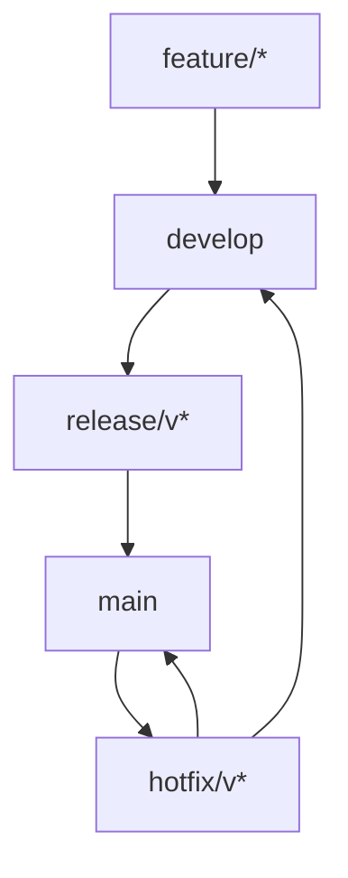

# 版本管理与镜像标签策略

## 版本号规范

### 语义化版本（SemVer）
采用 [语义化版本 2.0.0](https://semver.org/lang/zh-CN/) 规范：
```
主版本号.次版本号.修订号[-预发布标签][+构建元数据]

示例：
v1.0.0           # 正式发布
v1.1.0           # 向下兼容的功能新增
v1.1.1           # 向下兼容的问题修复
v1.2.0-beta.1    # 预发布版本
v1.2.0-rc.1      # 发布候选版本
v1.2.0+build.123 # 带有构建元数据的版本
```

### 版本号定义
| 版本段 | 递增规则 | 示例 | 说明 |
|--------|----------|------|------|
| 主版本号 | 不兼容的API修改 | 1.0.0 → 2.0.0 | 重大架构变更 |
| 次版本号 | 向下兼容的功能新增 | 1.0.0 → 1.1.0 | 新功能、改进 |
| 修订号 | 向下兼容的问题修复 | 1.0.0 → 1.0.1 | Bug修复、补丁 |
| 预发布标签 | 预发布标识 | -alpha.1, -beta.1, -rc.1 | 测试版本 |
| 构建元数据 | 构建信息 | +build.20260101 | 构建时间、提交哈希 |

### 版本发布周期
| 版本类型 | 发布频率 | 分支策略 | 质量要求 |
|----------|----------|----------|----------|
| 修订版本 | 按需发布（紧急修复） | hotfix/* → main | 通过回归测试 |
| 次版本 | 每月一次 | feature/* → develop → main | 通过完整测试 |
| 主版本 | 每季度一次 | epic/* → develop → main | 通过验收测试 |

## 镜像标签策略

### 标签格式
```
{registry}/{repository}/{image}:{tag}

示例：
ghcr.io/company/internship-backend:v1.0.0
ghcr.io/company/internship-backend:latest
ghcr.io/company/internship-backend:main-abc1234
```

### 标签类型
| 标签 | 格式 | 示例 | 用途 |
|------|------|------|------|
| 版本标签 | v{M}.{m}.{p} | v1.0.0, v1.1.0 | 正式发布 |
| 浮动标签 | latest, stable | latest | 最新稳定版 |
| 分支标签 | {branch} | main, develop | 分支最新构建 |
| 提交标签 | {branch}-{sha} | main-abc1234 | 特定提交构建 |
| 环境标签 | {env}-{timestamp} | staging-20260101 | 环境部署 |
| 预发布标签 | v{M}.{m}.{p}-{type}.{n} | v1.2.0-rc.1 | 测试版本 |

### 标签保留策略
| 标签类型 | 保留数量 | 保留时间 | 清理规则 |
|----------|----------|----------|----------|
| 版本标签 | 全部 | 永久 | 不自动清理 |
| 浮动标签 | 1个 | 永久 | 随新版本更新 |
| 分支标签 | 10个 | 30天 | 按时间清理旧标签 |
| 提交标签 | 20个 | 7天 | 按提交时间清理 |
| 环境标签 | 5个/环境 | 14天 | 按部署时间清理 |
| 预发布标签 | 5个/版本 | 30天 | 正式发布后清理 |

## Git分支策略

### 分支结构
```
main (保护分支)
├── release/v1.0.0 (发布分支)
├── release/v1.1.0
├── develop (开发分支)
│   ├── feature/parser-optimization
│   ├── feature/new-crawler
│   └── bugfix/search-timeout
└── hotfix/v1.0.1 (紧急修复)
```

### 分支命名规范
| 分支类型 | 命名格式 | 示例 | 说明 |
|----------|----------|------|------|
| 功能分支 | feature/{short-desc} | feature/parser-optimization | 新功能开发 |
| 缺陷修复 | bugfix/{issue-id} | bugfix/search-timeout | Bug修复 |
| 发布分支 | release/v{version} | release/v1.0.0 | 版本发布准备 |
| 热修复分支 | hotfix/v{version} | hotfix/v1.0.1 | 生产环境紧急修复 |
| 文档分支 | docs/{topic} | docs/api-reference | 文档更新 |

### 分支生命周期


## 构建流水线

### 触发规则
| 事件 | 触发条件 | 构建动作 | 镜像标签 |
|------|----------|----------|----------|
| Push to main | 合并PR后 | 构建、测试、推送 | {sha}, main-{sha}, latest |
| Push to release/* | 创建发布分支 | 构建、测试、推送 | v{version}-rc.{n} |
| Push tag v* | 打版本标签 | 构建、测试、推送 | v{version} |
| Push to develop | 每日构建 | 构建、测试 | develop-{sha} |
| Manual trigger | 手动触发 | 按需构建 | custom-{timestamp} |

### 构建矩阵
```yaml
# GitHub Actions构建矩阵示例
strategy:
  matrix:
    platform: [linux/amd64, linux/arm64]
    python-version: ['3.9', '3.10', '3.11']
  fail-fast: false
```

## 部署策略

### 环境部署映射
| 环境 | 分支/标签 | 部署频率 | 验证要求 |
|------|-----------|----------|----------|
| 开发环境 | develop-{sha} | 每次推送 | 单元测试通过 |
| 测试环境 | feature/* 合并后 | 每日 | 集成测试通过 |
| 预发环境 | release/* | 版本发布前 | 性能测试通过 |
| 生产环境 | v{version} | 正式发布 | 所有测试通过 |

### 滚动更新策略
```yaml
# Kubernetes滚动更新配置
spec:
  strategy:
    type: RollingUpdate
    rollingUpdate:
      maxSurge: 1
      maxUnavailable: 0
  minReadySeconds: 30
  progressDeadlineSeconds: 600
```

## 版本发布流程

### 发布准备阶段
1. **功能冻结**（D-7天）
   - 停止新功能合并
   - 专注Bug修复
   - 更新CHANGELOG

2. **发布分支创建**（D-5天）
   ```bash
   git checkout develop
   git pull origin develop
   git checkout -b release/v1.2.0
   git push origin release/v1.2.0
   ```

3. **测试验证**（D-5天至D-1天）
   - 集成测试
   - 性能测试
   - 安全扫描
   - 用户验收测试

### 发布执行阶段
1. **版本号确认**（D-1天）
   ```bash
   # 更新版本号
   echo "1.2.0" > VERSION
   
   # 更新CHANGELOG
   # 更新pyproject.toml/package.json
   ```

2. **创建发布标签**（D-Day）
   ```bash
   git tag -a v1.2.0 -m "Release v1.2.0"
   git push origin v1.2.0
   ```

3. **构建发布镜像**（自动）
   ```bash
   # GitHub Actions自动构建
   # 推送镜像: v1.2.0, latest
   ```

4. **生产环境部署**（D-Day）
   ```bash
   ./scripts/deploy.sh production v1.2.0
   ```

### 发布后阶段
1. **监控观察**（D+1天至D+3天）
   - 监控核心指标
   - 收集用户反馈
   - 处理紧急问题

2. **文档更新**（D+7天内）
   - 更新API文档
   - 更新用户手册
   - 更新部署文档

3. **发布总结**（D+7天）
   - 分析发布数据
   - 总结问题经验
   - 优化发布流程

## 回滚策略

### 自动回滚条件
| 指标 | 阈值 | 检测窗口 | 回滚动作 |
|------|------|----------|----------|
| 错误率 | >10% | 5分钟 | 自动回滚到上一版本 |
| 响应时间(P95) | >15s | 10分钟 | 自动回滚到上一版本 |
| 健康检查失败 | 连续3次 | 2分钟 | 自动重启，失败则回滚 |
| 业务指标异常 | 下降30% | 30分钟 | 人工确认后回滚 |

### 手动回滚流程
```bash
# 查看可用备份
ls -la backups/production_*.sql

# 执行回滚
./scripts/rollback.sh production 20260101_120000

# 验证回滚
curl -f https://internship.example.com/health
```

## 版本兼容性

### API兼容性
| 变更类型 | 版本影响 | 处理策略 |
|----------|----------|----------|
| 新增端点 | 向后兼容 | 无需特别处理 |
| 修改请求/响应 | 可能不兼容 | 版本前缀（/api/v2/） |
| 删除端点 | 不兼容 | 维护期后删除，提前通知 |
| 参数变更 | 可能不兼容 | 支持新旧参数，逐步迁移 |

### 数据库兼容性
| 变更类型 | 迁移策略 | 回滚方案 |
|----------|----------|----------|
| 新增表 | 向前兼容 | 可回滚 |
| 新增字段 | 可空字段 | 可回滚 |
| 修改字段 | 数据迁移脚本 | 备份恢复 |
| 删除字段 | 标记弃用，逐步移除 | 字段恢复 |

### 客户端兼容性
| 客户端类型 | 支持版本 | 更新策略 |
|------------|----------|----------|
| Web前端 | 最新2个主版本 | 自动更新 |
| 移动端App | 最新3个主版本 | 应用商店更新 |
| API客户端 | 最新1个主版本 | 文档通知 |

## 工具与自动化

### 版本管理工具
| 工具 | 用途 | 配置位置 |
|------|------|----------|
| semantic-release | 自动版本发布 | .releaserc.json |
| conventional-changelog | 生成CHANGELOG | package.json |
| bump2version | 版本号递增 | .bumpversion.cfg |
| GitHub Releases | 发布管理 | GitHub仓库 |

### 镜像仓库管理
```bash
# 查看镜像标签
docker images ghcr.io/company/internship-backend

# 清理旧镜像
docker image prune --filter "until=168h" --force

# 镜像安全扫描
trivy image ghcr.io/company/internship-backend:v1.0.0
```

## 监控与度量

### 版本健康度指标
| 指标 | 计算方法 | 目标值 |
|------|----------|--------|
| 发布成功率 | 成功发布次数/总发布次数 | ≥95% |
| 回滚率 | 回滚次数/发布次数 | ≤5% |
| 平均修复时间(MTTR) | 问题发现到修复的时间 | <4小时 |
| 用户满意度 | 用户反馈评分 | ≥4.0/5.0 |

### 发布看板
| 看板项 | 数据源 | 更新频率 |
|--------|--------|----------|
| 版本发布日历 | GitHub Releases | 实时 |
| 部署状态 | GitHub Actions | 实时 |
| 生产环境监控 | Prometheus/Grafana | 实时 |
| 用户反馈 | 反馈系统 | 每日 |

## 附录

### CHANGELOG格式
```markdown
# Changelog

## [1.2.0] - 2026-01-15
### Added
- 新增意向解析算法，准确率提升15%
- 支持BOSS直聘、智联招聘双平台搜索

### Changed
- 优化岗位搜索性能，响应时间减少30%
- 改进问题生成质量，相关性评分提升20%

### Fixed
- 修复数据库连接池泄漏问题
- 修复移动端布局显示问题

### Security
- 升级依赖包，修复CVE-2025-12345漏洞
```

### 版本发布检查清单
- [ ] 所有测试通过（单元、集成、性能）
- [ ] 安全扫描无高危漏洞
- [ ] 文档更新完成（API、用户、部署）
- [ ] CHANGELOG已更新
- [ ] 版本号已确认并更新
- [ ] 依赖包版本已锁定
- [ ] 数据库迁移脚本测试通过
- [ ] 回滚方案已准备
- [ ] 相关人员已通知
- [ ] 监控告警配置完成

### 紧急发布流程
1. **评估紧急程度**（P0/P1/P2）
2. **创建hotfix分支**
3. **最小化修改**（仅修复问题）
4. **快速测试验证**
5. **紧急发布审批**
6. **部署到生产环境**
7. **监控观察**
8. **合并回develop分支**

### 联系人列表
| 角色 | 姓名 | 联系方式 | 职责 |
|------|------|----------|------|
| 版本经理 | 张三 | 13800138000 | 版本发布协调 |
| 质量保证 | 李四 | 13900139000 | 测试验证 |
| 运维支持 | 王五 | 13700137000 | 部署监控 |
| 安全审查 | 赵六 | 13600136000 | 安全检查 |