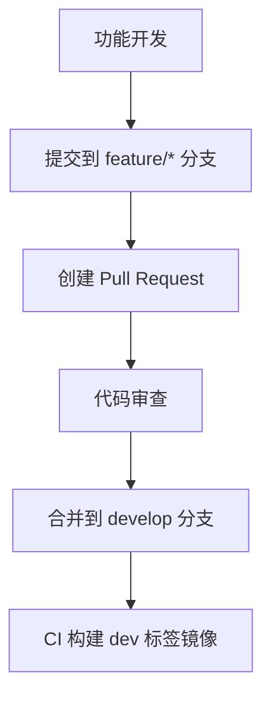
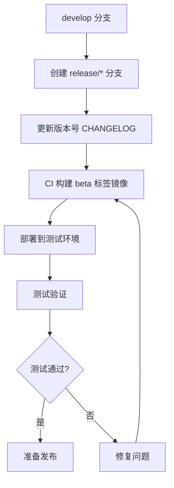
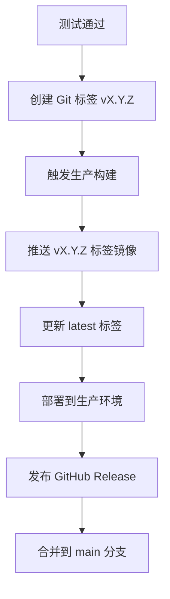

# 版本管理与镜像标签策略

## 概述

本文档定义 Internship AI Assistant 项目的版本管理和 Docker 镜像标签策略，确保版本清晰可追溯，支持多环境部署和回滚。

## 版本命名规范

### 1. 语义化版本（Semantic Versioning）

采用 [语义化版本 2.0.0](https://semver.org/) 规范：

```
主版本号.次版本号.修订号[-预发布标签][+构建元数据]
```

| 部分 | 说明 | 递增规则 | 示例 |
|------|------|----------|------|
| 主版本号 | 不兼容的 API 修改 | 重大架构变化、不兼容 API 变更 | 1 → 2 |
| 次版本号 | 向下兼容的功能性新增 | 新功能、性能优化、依赖升级 | 1.0 → 1.1 |
| 修订号 | 向下兼容的问题修正 | Bug 修复、安全补丁 | 1.0.0 → 1.0.1 |
| 预发布标签 | 预览版本标识 | alpha, beta, rc | 1.0.0-alpha.1 |
| 构建元数据 | 构建信息 | 提交哈希、时间戳 | 1.0.0+20260101.120000 |

### 2. 版本类型与用途

| 版本类型 | 格式 | 用途 | 发布渠道 |
|----------|------|------|----------|
| 正式版本 | `vX.Y.Z` | 生产环境发布 | GitHub Release，Docker Hub |
| 预发布版本 | `vX.Y.Z-alpha.N` | 内部测试 | 内部镜像仓库 |
| 预发布版本 | `vX.Y.Z-beta.N` | 公测版本 | 预发布环境 |
| 预发布版本 | `vX.Y.Z-rc.N` | 发布候选 | 准生产环境 |
| 开发版本 | `vX.Y.Z-dev+<commit>` | 持续集成 | CI/CD 流水线 |

### 3. 版本发布周期

| 版本类型 | 发布频率 | 稳定性要求 | 支持周期 |
|----------|----------|------------|----------|
| 主版本 | 6-12 个月 | 极高 | 24 个月 |
| 次版本 | 1-2 个月 | 高 | 12 个月 |
| 修订版 | 按需发布（1-4 周） | 中 | 6 个月 |
| 安全补丁 | 紧急发布（<72h） | 极高 | 直至下一版本 |

## Docker 镜像标签策略

### 1. 镜像命名规范

镜像名称遵循：`registry/namespace/repository:tag`

```
ghcr.io/username/internship-backend:v1.0.0
```

- **registry**: 镜像仓库地址（ghcr.io, docker.io）
- **namespace**: 组织或用户名
- **repository**: 应用名称（internship-backend, internship-frontend）
- **tag**: 版本标签

### 2. 标签类型

| 标签类型 | 格式 | 说明 | 示例 |
|----------|------|------|------|
| 版本标签 | `vX.Y.Z` | 语义化版本 | `v1.2.3` |
| 浮动标签 | `latest` | 最新稳定版本 | `latest` |
| 浮动标签 | `stable` | 当前稳定版本 | `stable` |
| 浮动标签 | `beta` | 最新测试版本 | `beta` |
| 分支标签 | `main-<hash>` | 分支最新提交 | `main-a1b2c3d` |
| 环境标签 | `staging`, `production` | 环境专用标签 | `staging-v1.2.3` |
| 架构标签 | `-amd64`, `-arm64` | 多架构支持 | `v1.2.3-amd64` |

### 3. 多环境标签策略

| 环境 | 标签模式 | 自动构建 | 推送目标 |
|------|----------|----------|----------|
| 开发 | `dev-<commit_hash>` | 每次提交 | 开发镜像仓库 |
| 测试 | `test-<date>-<build>` | 每日构建 | 测试镜像仓库 |
| 预发布 | `staging-vX.Y.Z` | 标签推送 | 预发布仓库 |
| 生产 | `vX.Y.Z` | 发布创建 | 生产仓库 |

### 4. GitHub Actions 自动标签

CI/CD 流水线自动生成以下标签：

```yaml
tags: |
  # 语义化版本标签
  type=ref,event=tag  # v1.0.0 → v1.0.0
  
  # 主要版本浮动标签
  type=semver,pattern={{major}}.{{minor}}  # v1.0.0 → 1.0
  type=semver,pattern={{major}}  # v1.0.0 → 1
  
  # 分支标签
  type=ref,event=branch  # main → main
  type=sha,prefix={{branch}}-  # main-a1b2c3d
  
  # 环境标签
  type=raw,value=latest,enable=${{ github.ref == 'refs/heads/main' }}
  type=raw,value=staging,enable=${{ github.ref == 'refs/heads/release/*' }}
```

## 版本发布流程

### 1. 开发阶段


### 2. 测试阶段


### 3. 发布阶段


## 版本管理工具

### 1. 版本文件
- `pyproject.toml` / `package.json`：定义项目版本
- `CHANGELOG.md`：记录版本变更
- `VERSION`：纯文本版本文件

### 2. 自动化脚本

#### 版本升级脚本
```bash
#!/bin/bash
# scripts/bump_version.sh

# 升级修订号
./scripts/bump_version.sh patch

# 升级次版本号  
./scripts/bump_version.sh minor

# 升级主版本号
./scripts/bump_version.sh major

# 创建预发布版本
./scripts/bump_version.sh prerelease --preid=alpha
```

#### 版本校验脚本
```bash
#!/bin/bash
# scripts/verify_version.sh

# 验证版本格式
./scripts/verify_version.sh v1.2.3

# 检查版本冲突
./scripts/verify_version.sh --check-conflict v1.2.3

# 生成下一版本建议
./scripts/verify_version.sh --suggest
```

### 3. Git 工作流

#### 创建发布分支
```bash
git checkout develop
git pull origin develop
git checkout -b release/v1.2.0
```

#### 更新版本号
```bash
# 更新 Python 版本
poetry version 1.2.0

# 更新 Node.js 版本  
npm version 1.2.0

# 更新 VERSION 文件
echo "1.2.0" > VERSION
```

#### 创建 Git 标签
```bash
git add .
git commit -m "chore: release v1.2.0"
git tag -a v1.2.0 -m "Release v1.2.0"
git push origin v1.2.0
```

## 镜像仓库管理

### 1. 镜像清理策略

| 标签类型 | 保留策略 | 清理周期 |
|----------|----------|----------|
| `latest` | 保留最近 5 个 | 每月清理 |
| 版本标签 | 保留最近 10 个版本 | 每季度清理 |
| 预发布标签 | 保留最近 20 个 | 每月清理 |
| 分支标签 | 保留最近 30 天 | 每周清理 |
| 开发标签 | 保留最近 50 个 | 每日清理 |

### 2. 镜像安全扫描
- 推送时自动扫描漏洞
- 每周全量安全扫描
- 高危漏洞 24 小时内修复
- 中危漏洞 7 天内修复

### 3. 镜像签名验证
```bash
# 启用 Docker Content Trust
export DOCKER_CONTENT_TRUST=1

# 推送签名镜像
docker push ghcr.io/username/internship-backend:v1.0.0

# 拉取验证签名
docker pull ghcr.io/username/internship-backend:v1.0.0
```

## 回滚策略

### 1. 版本回滚
```bash
# 回滚到特定版本
./scripts/rollback.sh production v1.1.0

# 回滚到上一版本
./scripts/rollback.sh production previous

# 回滚到最新稳定版本
./scripts/rollback.sh production stable
```

### 2. 镜像回滚
```bash
# 更新 docker-compose 镜像标签
sed -i 's/image:.*/image: ghcr.io\/username\/internship-backend:v1.1.0/' docker-compose.prod.yml

# 重新部署
docker-compose -f docker-compose.prod.yml up -d
```

### 3. 数据库回滚
- 每日全量备份 + 每小时增量备份
- 支持时间点恢复（Point-in-Time Recovery）
- 回滚时自动恢复对应版本数据库

## 监控与审计

### 1. 版本部署监控
| 指标 | 告警阈值 | 监控频率 |
|------|----------|----------|
| 版本部署成功率 | <95% | 实时 |
| 版本回滚率 | >10% | 每天 |
| 版本升级时长 | >30分钟 | 每次部署 |
| 版本间故障率 | >5% | 每周 |

### 2. 镜像仓库审计
- 记录所有镜像推送/拉取操作
- 审计镜像签名验证结果
- 跟踪镜像漏洞扫描状态
- 监控镜像存储使用量

### 3. 版本合规检查
- 许可证合规性检查
- 依赖漏洞扫描
- 代码安全扫描
- 性能基准测试

## 附录

### 版本升级检查清单
- [ ] 更新所有版本文件
- [ ] 更新 CHANGELOG.md
- [ ] 运行完整测试套件
- [ ] 通过安全扫描
- [ ] 更新依赖版本
- [ ] 验证多环境部署
- [ ] 通知相关团队
- [ ] 备份当前版本

### 常用命令
```bash
# 查看当前版本
git describe --tags --abbrev=0

# 列出所有标签
git tag --list 'v*' --sort=-version:refname

# 比较版本差异
git diff v1.0.0..v1.1.0

# 清理旧镜像
docker image prune -a --filter "until=240h"
```

### 参考文档
- [语义化版本 2.0.0](https://semver.org/)
- [Docker 标签最佳实践](https://docs.docker.com/develop/dev-best-practices/)
- [GitHub Actions 元数据操作](https://github.com/docker/metadata-action)

---

**文档版本**: 1.0  
**更新日期**: 2026-04-11  
**负责人**: DevOps 团队