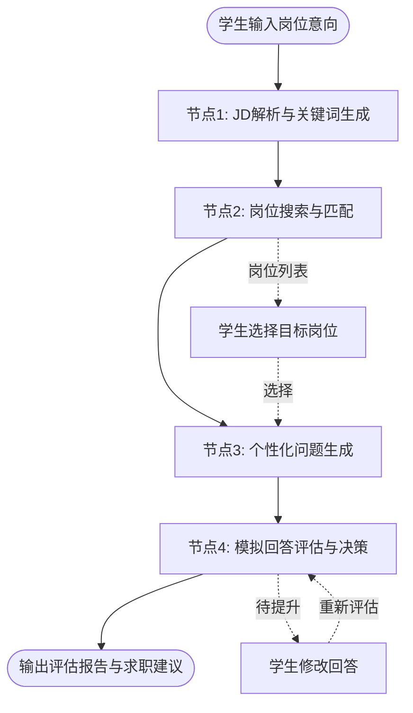

# 学生求职AI助手 - 原子任务工作流文档

**版本**：v1.0 MVP  
**日期**：2026-04-11  
**状态**：初稿

---

## 流程概述

本工作流面向在校大学生及应届毕业生，提供从"岗位意向输入"到"求职决策输出"的完整求职准备闭环。流程包含4个原子任务节点，覆盖岗位搜索、匹配筛选、问题生成、模拟评估四大核心能力。



---

## 任务节点拆解

### 节点1：岗位JD解析与求职关键词生成

#### 1.1 节点概述
将学生自然语言描述的岗位意向，转化为结构化的搜索关键词集合，供后续爬取使用。

#### 1.2 输入规范
| 字段 | 类型 | 必填 | 示例 |
|------|------|------|------|
| raw_input | String | 是 | "我想找一份2025年暑假的产品经理实习，地点上海或杭州，要求会Axure和数据分析" |

#### 1.3 输出规范
```json
{
  "岗位": ["产品经理", "产品助理", "产品实习"],
  "技能": ["Axure", "原型设计", "数据分析", "Excel", "SQL"],
  "地点": ["上海", "杭州"],
  "学历": "本科",
  "经验": "实习",
  "出勤": "4天/周",
  "标签": ["互联网", "B端"]
}
```

#### 1.4 处理逻辑
```
步骤1: 文本清洗
  └─ 去除语气词("我想"、"希望"、"想要")
  └─ 标准化时间表达("2025年暑假" → "实习")
  └─ 识别人称代词并去除

步骤2: 实体抽取
  ├─ 岗位名称识别（基于关键词库匹配）
  ├─ 技能关键词识别（技术栈/工具/方法论）
  ├─ 地点识别（城市名/行政区）
  ├─ 学历识别（本科/硕士/博士/不限）
  ├─ 经验识别（实习/校招/1-3年/3-5年）
  └─ 出勤要求识别（X天/周）

步骤3: 关键词扩展
  ├─ 岗位同义词扩展（"产品经理"→"产品助理"/"产品专员"）
  ├─ 技能关联扩展（"Axure"→"原型设计"/"线框图"/"PRD"）
  └─ 地点归一化（"魔都"→"上海"）

步骤4: 缺失值填充
  ├─ 学历未指定 → 默认"本科"
  ├─ 城市未指定 → 默认["北京","上海","广州","深圳","杭州"]
  └─ 出勤未指定 → 不填充
```

#### 1.5 规则与约束
- **去停用词**：必须过滤"我想"、"希望"、"想要"等自然语言残留
- **关键词质量**：每个类别至少提取1个有效关键词
- **无冗余**：不添加与目标无关的扩展词

#### 1.6 异常处理
| 异常场景 | 处理策略 |
|----------|----------|
| 输入过短（<5字） | 返回澄清问题："请详细描述您的目标岗位" |
| 无法识别岗位类型 | 返回常见岗位列表供选择 |
| 技能与岗位不匹配 | 提示："该岗位通常不需要XX技能，是否确认？" |

#### 1.7 验收标准
| 验收项 | 标准 |
|--------|------|
| 关键词覆盖率 | 覆盖学生目标中的岗位、技能、地点、学历、经验等核心要素 |
| 有效性 | 使用生成的关键词在招聘平台搜索，返回≥10个不同岗位 |
| 纯净度 | 无"我想"等自然语言残留，无无关词汇 |

---

### 节点2：岗位搜索与匹配

#### 2.1 节点概述
基于节点1生成的关键词，爬取四大招聘平台公开数据，计算岗位-学生匹配度，返回排序后的岗位列表。

#### 2.2 输入规范
| 字段 | 类型 | 必填 | 说明 |
|------|------|------|------|
| keywords | Object | 是 | 节点1输出的结构化关键词 |
| resume_text | String | 否 | 学生简历文本（用于匹配度计算） |

#### 2.3 输出规范
```json
{
  "total_count": 156,
  "filtered_count": 20,
  "jobs": [
    {
      "id": "md5_hash",
      "platform": "BOSS直聘",
      "company": "字节跳动",
      "job_title": "产品经理实习生",
      "location": "上海",
      "salary": "200-250元/天",
      "jd_text": "负责XX产品...",
      "jd_url": "https://www.zhipin.com/job/xxx",
      "match_score": 92,
      "match_details": {
        "技能匹配": ["Axure", "数据分析"],
        "地点匹配": true,
        "经验匹配": true
      },
      "publish_time": "2026-04-10"
    }
  ]
}
```

#### 2.4 处理逻辑
```
步骤1: 平台爬取（并行）
  ├─ BOSS直聘: https://www.zhipin.com/web/geek/job
  ├─ 猎聘: https://www.liepin.com/zhaopin/
  ├─ 智联招聘: https://sou.zhaopin.com/
  └─ 前程无忧: https://search.51job.com/
  
  技术实现:
  ├─ 构造查询参数（关键词+城市代码）
  ├─ 处理动态加载（Playwright渲染或XHR抓取）
  ├─ 设置反爬策略（User-Agent轮换、请求间隔1-3秒、代理IP池）
  └─ 错误重试（最多3次）

步骤2: 详情页爬取
  ├─ 遍历搜索结果中的岗位链接
  ├─ 访问详情页获取完整JD
  └─ 提取字段：岗位名称、公司、地点、薪资、JD全文、发布时间

步骤3: 数据清洗
  ├─ 薪资处理："面议" → null；"10-15K" → 保留原样
  ├─ 地点统一："上海-浦东" → "上海"
  ├─ 学历拆分："本科及以上" → "本科"
  └─ 时间标准化：统一为YYYY-MM-DD格式

步骤4: 匹配度计算
  ├─ 简历向量化：jieba分词 + TfidfVectorizer / Sentence-BERT
  ├─ JD向量化：同上
  ├─ 余弦相似度计算
  └─ 加权调整：技能匹配权重40%，地点匹配权重20%，经验匹配权重20%，学历匹配权重20%

步骤5: 去重
  ├─ 生成唯一标识：MD5(公司名+岗位名+地点)
  └─ 保留匹配度最高的记录

步骤6: 排序与截断
  ├─ 按match_score降序
  └─ 返回TOP20
```

#### 2.5 规则与约束
- **平台覆盖**：必须返回来自≥2个平台的岗位
- **数量保证**：有效岗位数≥10个（否则提示扩大搜索条件）
- **反爬合规**：单平台请求间隔≥1秒，遵守robots.txt
- **数据新鲜度**：优先返回7天内发布的岗位

#### 2.6 异常处理
| 异常场景 | 处理策略 |
|----------|----------|
| 某平台爬取失败 | 记录日志，使用其他平台数据，提示"XX平台暂不可用" |
| 反爬触发（403/验证码） | 切换代理IP，3次失败后放弃该平台 |
| 页面结构变更 | 记录错误，返回"该数据源维护中" |
| 返回结果<10 | 提示"建议扩大搜索条件（如增加城市、放宽技能要求）" |

#### 2.7 验收标准
| 验收项 | 标准 |
|--------|------|
| 岗位数量 | 返回≥10个有效岗位 |
| 平台多样性 | 来自≥2个不同平台 |
| 信息完整性 | 无缺失JD、公司名、地点；无重复URL |
| 匹配度质量 | TOP10岗位平均匹配度≥70% |
| 匹配度解释 | 评分≥60%的岗位需在技能或经验上有明显重合 |

---

### 节点3：个性化求职问题生成

#### 3.1 节点概述
针对学生选定的目标岗位，结合JD要求和简历内容，生成两套定制化面试问题（一般版+高阶版）。

#### 3.2 输入规范
| 字段 | 类型 | 必填 | 说明 |
|------|------|------|------|
| selected_job | Object | 是 | 学生选择的岗位信息（含JD全文） |
| resume_summary | Object | 否 | 学生简历结构化摘要（技能、项目、实习经历） |

#### 3.3 输出规范
```json
{
  "job_id": "md5_hash",
  "job_title": "产品经理实习生",
  "company": "字节跳动",
  "questions": {
    "general": [
      {
        "id": "q1",
        "type": "技能",
        "question": "请描述一个你使用Axure完成的原型设计，并说明你是如何验证其可用性的。",
        "target_competency": "原型设计能力",
        "jd_reference": "熟练使用Axure进行原型设计"
      }
    ],
    "advanced": [
      {
        "id": "a1",
        "type": "业务理解",
        "question": "假设你负责的产品日活下降5%，你会如何分析原因并推动解决？请列出你的分析框架。",
        "target_competency": "数据分析与问题解决",
        "jd_reference": "具备数据分析能力，能通过数据发现问题"
      }
    ]
  },
  "coverage_analysis": {
    "jd_key_requirements": ["Axure", "数据分析", "用户研究"],
    "covered_requirements": ["Axure", "数据分析"],
    "uncovered_requirements": ["用户研究"]
  }
}
```

#### 3.4 处理逻辑
```
步骤1: JD解析
  ├─ 提取关键能力要求（技能、经验、软技能）
  ├─ 识别硬性要求（必须）vs 优先条件（加分）
  └─ 标注每项要求的能力类型

步骤2: 简历分析
  ├─ 提取技能列表
  ├─ 提取项目/实习经历
  └─ 识别与JD的匹配点和差距点

步骤3: 一般版问题生成（3-5个）
  生成原则:
  ├─ 侧重基础技能验证
  ├─ 侧重执行力（能否完成任务）
  ├─ 侧重学习能力（如何快速上手）
  └─ 问题具体、可操作
  
  模板类型:
  ├─ 技能验证型："请描述你使用XX完成过的一个任务"
  ├─ 经历挖掘型："你过去实习中完成的最标准化任务是什么？"
  └─ 学习适应型："如果要求你一周内掌握XX，你会怎么做？"

步骤4: 高阶版问题生成（3-5个）
  生成原则:
  ├─ 侧重项目深度（系统性思考）
  ├─ 侧重问题解决（复杂场景分析）
  ├─ 侧重业务理解（商业洞察）
  └─ 侧重团队协作（沟通与推动）
  
  模板类型:
  ├─ 场景分析型："假设XX情况发生，你会如何分析/处理？"
  ├─ 复盘反思型："请分享一个失败经历，你学到了什么？"
  ├─ 策略规划型："如果让你负责XX，你会如何制定计划？"
  └─ 冲突处理型："描述一次你与团队产生分歧的经历"

步骤5: 去重与优化
  ├─ 检测问题相似度，去除重复
  ├─ 确保每个问题对应JD中的至少一项关键能力
  └─ 控制问题表述清晰度
```

#### 3.5 规则与约束
- **覆盖要求**：问题需覆盖JD中的关键能力，覆盖率≥90%
- **区分度**：一般版与高阶版问题在难度和考察维度上有明显区分
- **关联性**：每个问题需标注对应的JD原文依据
- **数量控制**：每个版本3-5个问题，总数不超过10个

#### 3.6 异常处理
| 异常场景 | 处理策略 |
|----------|----------|
| JD内容过短/无法解析 | 使用同类岗位通用问题模板 |
| 简历为空 | 生成通用问题，降低针对性要求 |
| JD要求与学生背景严重不匹配 | 提示"该岗位与您的背景差异较大，建议考虑XX类岗位" |

#### 3.7 验收标准
| 验收项 | 标准 |
|--------|------|
| JD覆盖度 | 问题覆盖JD中≥90%的关键能力要求 |
| 问题质量-一般版 | 具体、可操作，适合基础能力验证 |
| 问题质量-高阶版 | 要求战略/复盘/业务思维，适合深度考察 |
| 数量 | 每个岗位3-5个一般版 + 3-5个高阶版 |
| 区分度 | 两版问题在难度和考察维度上明显不同 |

---

### 节点4：模拟回答评估与求职决策

#### 4.1 节点概述
接收学生对生成问题的模拟回答，进行多维度评估，输出评分、改进建议和求职决策。

#### 4.2 输入规范
| 字段 | 类型 | 必填 | 说明 |
|------|------|------|------|
| question_id | String | 是 | 问题ID |
| question_text | String | 是 | 问题原文 |
| question_type | String | 是 | 问题类型（技能/业务/经历等） |
| jd_requirements | Array | 是 | 该问题对应的JD要求 |
| student_answer | String | 是 | 学生回答文本 |

#### 4.3 输出规范
```json
{
  "evaluation": {
    "question_id": "q1",
    "scores": {
      "overall": 7.5,
      "dimensions": {
        "岗位技能覆盖度": 8,
        "案例具体性": 7,
        "逻辑表达": 8,
        "量化成果": 6
      }
    },
    "keyword_matches": [
      {"keyword": "Axure", "found": true, "context": "我用Axure画了原型"},
      {"keyword": "可用性测试", "found": false, "context": null}
    ],
    "strengths": [
      "提到了具体的工具使用（Axure）",
      "描述了完整的操作流程"
    ],
    "improvements": [
      {
        "aspect": "缺少量化成果",
        "suggestion": "建议补充具体数据，如'原型设计效率提升30%'",
        "example": "通过组件库复用，将原型设计时间从3天缩短至2天"
      },
      {
        "aspect": "未涉及可用性验证",
        "suggestion": "建议补充用户测试或反馈收集环节",
        "jd_reference": "JD要求：'能根据用户反馈迭代设计'"
      }
    ],
    "suggested_script": "参考话术：'我使用Axure完成了XX功能的原型设计，通过组件库复用提升了设计效率。设计完成后，我组织了3位目标用户进行可用性测试，收集了5条有效反馈并完成了2轮迭代，最终方案使任务完成率提升了15%。'"
  },
  "decision": {
    "status": "待提升",
    "threshold": "综合分≥7分建议通过，5-7分待提升，<5分不通过",
    "recommendation": "建议补充量化成果和可用性验证环节后重新评估"
  }
}
```

#### 4.4 处理逻辑
```
步骤1: 内容质量检查
  ├─ 检查回答长度（过短提示补充）
  ├─ 检查是否答非所问
  └─ 检测敏感/违规内容

步骤2: 关键词匹配分析
  ├─ 提取JD要求的关键词集合
  ├─ 在回答中搜索关键词出现情况
  └─ 记录匹配到的关键词及上下文

步骤3: 语义相似度分析
  ├─ 将回答与期望回答方向进行向量化
  ├─ 计算余弦相似度
  └─ 评估内容相关性

步骤4: 多维度评分（1-10分）
  ├─ 岗位技能覆盖度：回答中包含JD要求关键词的比例
  ├─ 案例具体性：是否有具体项目/场景描述
  ├─ 逻辑表达：结构是否清晰（背景-行动-结果）
  └─ 量化成果：是否包含具体数据/效果

步骤5: 亮点提取
  ├─ 识别回答中的优秀表述
  └─ 标注与JD匹配的内容

步骤6: 改进建议生成
  ├─ 识别缺失的JD要求
  ├─ 生成针对性建议话术
  └─ 提供参考示例

步骤7: 综合决策
  ├─ 计算综合得分（维度平均分）
  ├─ 判定决策等级：
  │   ├─ ≥7分：通过（建议投递）
  │   ├─ 5-7分：待提升（建议修改后重试）
  │   └─ <5分：不通过（需系统性提升）
  └─ 生成决策建议
```

#### 4.5 规则与约束
- **评分透明**：每个维度评分需展示计算依据
- **可解释性**：高亮回答中匹配JD的短语
- **建设性**：改进建议需具体可执行，避免泛泛批评
- **参考话术**：提供优化后的参考回答示例

#### 4.6 异常处理
| 异常场景 | 处理策略 |
|----------|----------|
| 回答为空或极短 | 提示"回答内容不足，请详细描述"，不进入评分 |
| 回答与问题无关 | 提示"回答似乎未针对该问题，请检查后重试" |
| 评估算法异常 | 记录日志，返回"评估服务暂时异常，请稍后重试" |

#### 4.7 验收标准
| 验收项 | 标准 |
|--------|------|
| 评估准确性 | 能快速判断学生与岗位的契合度 |
| 可解释性 | 输出评分维度说明，高亮匹配短语 |
| 建议质量 | 改进建议具体可执行，附带参考话术 |
| 决策清晰度 | 明确输出"通过/待提升/不通过"及依据 |
| 持久化 | 评估结果可保存、可导出 |

---

## 四大平台爬虫技术要点

### BOSS直聘
| 项目 | 说明 |
|------|------|
| 入口 | https://www.zhipin.com/web/geek/job |
| 参数 | query=关键词&city=城市代码（101020100=上海） |
| 提取 | 岗位标题、薪资、公司名、工作地点、经验学历要求、详情页链接 |
| 技术 | 动态加载，需抓取XHR请求或直接渲染 |
| 注意 | 需处理登录态，部分数据需模拟游客Cookie |

### 猎聘
| 项目 | 说明 |
|------|------|
| 入口 | https://www.liepin.com/zhaopin/ |
| 参数 | key=关键词&dqs=城市代码（020=上海） |
| 提取 | 岗位名称、公司、薪资、地区、学历经验、JD摘要 |
| 技术 | 反爬较强，建议使用Playwright渲染 |
| 注意 | 设置随机延时（2-5秒） |

### 智联招聘
| 项目 | 说明 |
|------|------|
| 入口 | https://sou.zhaopin.com/ |
| 参数 | kw=关键词&city=城市代码（538=上海） |
| 提取 | 岗位ID、名称、公司、薪资、工作地点、发布时间、JD链接 |
| 技术 | 可解析JSON接口（F12监控网络请求） |
| 注意 | 注意分页参数处理 |

### 前程无忧
| 项目 | 说明 |
|------|------|
| 入口 | https://search.51job.com/list/ |
| 参数 | 关键词和城市代码在URL路径中 |
| 提取 | 岗位名、公司、地点、薪资、经验学历、JD详情 |
| 技术 | 有反爬，需设置请求头Referer |
| 注意 | 详情页需使用lxml提取完整内容 |

---

## 数据统一处理流程

```
┌─────────────┐    ┌─────────────┐    ┌─────────────┐    ┌─────────────┐    ┌─────────────┐
│  原始数据    │───▶│  数据清洗    │───▶│  匹配度计算  │───▶│  去重处理    │───▶│  结果排序    │
│  爬取        │    │              │    │              │    │              │    │              │
└─────────────┘    └─────────────┘    └─────────────┘    └─────────────┘    └─────────────┘
                          │
    清洗规则:               │         计算方法:            去重规则:           排序规则:
    - 薪资"面议"→null       │         - jieba分词          - MD5(公司+岗位+地点)  - 匹配度降序
    - 地点"上海-浦东"→"上海" │         - TF-IDF向量化       - 保留匹配度最高       - 发布时间降序
    - 学历"本科及以上"→"本科" │         - 余弦相似度         - 更新时间戳
    - 时间标准化            │         - 加权调整
```

---

## 完整交互流程示例

```
学生: "我想找前端开发实习，地点北京或深圳，会React和Vue，希望有项目经验要求，每周出勤4天以上"

AI: [节点1] 已解析关键词：
    {岗位:"前端开发 实习", 技能:["React","Vue"], 地点:["北京","深圳"], 出勤:"4天/周"}

AI: [节点2] 正在搜索匹配岗位...
    ├─ BOSS直聘: 找到58个岗位
    ├─ 智联招聘: 找到42个岗位
    ├─ 前程无忧: 找到31个岗位
    └─ 猎聘: 找到25个岗位
    
    为您推荐以下高匹配岗位：
    ┌───┬──────────┬─────────────────┬────────┬────────┐
    │排名│ 平台      │ 公司-岗位        │ 地点   │ 匹配度 │
    ├───┼──────────┼─────────────────┼────────┼────────┤
    │ 1 │ BOSS直聘 │ 字节跳动-前端实习生 │ 北京   │  92%   │
    │ 2 │ 智联招聘 │ 美团-前端开发实习   │ 北京   │  87%   │
    │ 3 │ 前程无忧 │ XX科技-Vue前端实习  │ 深圳   │  71%   │
    └───┴──────────┴─────────────────┴────────┴────────┘
    
    请选择您想了解的岗位（输入序号）：

学生: "2"

AI: [节点3] 已为"美团-前端开发实习"生成定制化问题：
    
    【一般实习版】
    1. 请描述一个你使用React开发的组件，并说明如何确保其性能。
    2. ...
    
    【高阶实习/校招版】
    1. 假设团队要从Vue迁移到React，你会如何规划迁移策略？请列出关键风险点。
    2. ...
    
    请选择一个问题进行模拟回答：

学生: [输入回答] "我做过一个商品列表组件，用React hooks写的，还做了分页加载。"

AI: [节点4] 评估结果：
    
    评分: 5/10
    ├─ 岗位技能覆盖度: 7/10 (提到了React hooks)
    ├─ 案例具体性: 6/10 (有具体组件描述)
    ├─ 逻辑表达: 5/10 (缺少完整STAR结构)
    └─ 量化成果: 3/10 (无具体数据)
    
    改进建议:
    • 缺少性能优化细节，建议补充：虚拟滚动、useMemo、懒加载等
    • 缺少量化成果，建议补充：首屏加载时间从X秒降至Y秒
    
    参考话术:
    "我使用React hooks开发了一个商品列表组件，采用虚拟滚动(react-window)处理千级数据，
     使用useMemo缓存计算结果，首屏加载时间从3秒降至1.2秒，用户滑动帧率保持在60fps。"
    
    综合匹配度: 待提升
    建议: 修改后重新评估
```

---

## 版本记录

| 版本 | 日期 | 修改内容 |
|------|------|----------|
| v1.0 MVP | 2026-04-11 | 初始版本，基于需求文档创建 |

---

## 推导项与假设项汇总

| 内容 | 类型 | 说明 |
|------|------|------|
| 爬虫技术栈为Scrapy/Playwright | 推导项 | 需求文档示例 |
| 匹配度算法为TF-IDF/BERT | 推导项 | 需求文档示例 |
| 请求间隔1-3秒 | 假设项 | 反爬合规平衡 |
| 数据保留7天 | 假设项 | 新鲜度平衡 |
| 评分维度为4个 | 推导项 | 需求文档覆盖要求 |
